# C4 Code — admin/src/components

## Overview

- **Name**: Admin UI Components
- **Location**: `admin/src/components/`
- **Primary Language**: TypeScript / React 19
- **Purpose**: Reusable UI components for the admin dashboard (PixelCart). Organized into eight subdirectories covering layout scaffolding, authentication gating, analytics visualization, order and product domain widgets, shared cross-cutting utilities, and a foundational design-system primitive layer.

---

## Code Elements

### `ui/` — Design System Primitives

These are the lowest-level building blocks. They have no domain knowledge and no API calls; they accept data through props and emit events through callbacks.

---

#### `Button`

**File**: `admin/src/components/ui/Button.tsx`

**Props interface**:
```ts
type ButtonProps = {
  variant?: 'primary' | 'secondary' | 'outline' | 'ghost' | 'destructive';
  size?: 'sm' | 'md' | 'lg' | 'icon';
  href?: string;
  children: React.ReactNode;
  className?: string;
} & Omit<React.ButtonHTMLAttributes<HTMLButtonElement>, 'className'>;
```

**Description**: Renders either a React Router `<Link>` (when `href` is given) or a native `<button>`. Applies variant and size class combinations from static lookup maps.

**Key behaviors**:
- When `href` is present, delegates to `react-router-dom`'s `<Link to={href}>`.
- All native button attributes (`onClick`, `disabled`, `type`, etc.) are forwarded via rest spread.
- `disabled` state sets `opacity-50 pointer-events-none` via Tailwind.

---

#### `Card`

**File**: `admin/src/components/ui/Card.tsx`

**Props interface**:
```ts
type CardProps = {
  children: React.ReactNode;
  className?: string;
  padding?: boolean;   // default: true
};
```

**Description**: Renders a surface container (`bg-surface rounded-xl border shadow-sm`). `padding={false}` removes the `p-6` default, useful when the child needs edge-to-edge content (e.g., charts, tables).

---

#### `Input`

**File**: `admin/src/components/ui/Input.tsx`

**Props interface**:
```ts
type InputProps = {
  label?: string;
  error?: string;
} & React.InputHTMLAttributes<HTMLInputElement>;
```

**Description**: Labeled text input with optional inline error message. The `id` attribute is auto-derived from `label` if not provided (lowercased, spaces replaced with `-`). Error state applies `border-destructive` ring styling.

---

#### `Select`

**File**: `admin/src/components/ui/Select.tsx`

**Props interface**:
```ts
type SelectProps = {
  label?: string;
  options: { value: string; label: string }[];
  error?: string;
} & React.SelectHTMLAttributes<HTMLSelectElement>;
```

**Description**: Labeled `<select>` with options rendered from a typed array. Shares the same label-derivation and error-styling conventions as `Input`.

---

#### `Textarea`

**File**: `admin/src/components/ui/Textarea.tsx`

**Props interface**:
```ts
type TextareaProps = {
  label?: string;
  error?: string;
} & React.TextareaHTMLAttributes<HTMLTextAreaElement>;
```

**Description**: Labeled `<textarea>` with a `min-h-[100px] resize-y` default. Identical label-derivation and error-handling as `Input`.

---

#### `Badge`

**File**: `admin/src/components/ui/Badge.tsx`

**Props interface**:
```ts
type BadgeProps = {
  variant?: 'default' | 'accent' | 'success' | 'warning' | 'destructive' | 'outline';
  dot?: boolean;
  children: React.ReactNode;
  className?: string;
};
```

**Description**: Inline pill label. The optional `dot` prop renders a colored leading dot whose color matches the variant (e.g., `bg-emerald-500` for `success`).

---

#### `Modal`

**File**: `admin/src/components/ui/Modal.tsx`

**Props interface**:
```ts
type ModalProps = {
  open: boolean;
  onClose: () => void;
  title: string;
  children: React.ReactNode;
  footer?: React.ReactNode;
};
```

**Description**: Fixed-position overlay dialog with a backdrop. Renders nothing (`null`) when `open` is false.

**Key behaviors**:
- Registers a `keydown` listener for `Escape` → calls `onClose`.
- Backdrop click calls `onClose`.
- Optional `footer` slot renders a right-aligned button row below a border.

---

#### `Table`

**File**: `admin/src/components/ui/Table.tsx`

**Props interface**:
```ts
type Column<T> = {
  key: string;
  header: string;
  render: (item: T) => React.ReactNode;
  className?: string;
  sortable?: boolean;
  sortValue?: (item: T) => string | number;
};

type TableProps<T> = {
  columns: Column<T>[];
  data: T[];
  rowKey: (item: T) => string;
  onRowClick?: (item: T) => void;
  emptyMessage?: string;
  selectable?: boolean;
  onSelectionChange?: (ids: string[]) => void;
  sortKey?: string;
  sortDirection?: SortDirection;
  onSortChange?: (key: string, dir: SortDirection) => void;
  page?: number;
  pageSize?: number;
  total?: number;
  onPageChange?: (page: number) => void;
};
```

**Description**: Generic data table with per-column render functions. Manages an internal `selectedIds: Set<string>` state for row checkboxes (when `selectable` is true).

**Key behaviors**:
- Header checkbox toggles all visible rows; indeterminate state is set via DOM ref when some but not all rows are selected.
- Sort cycles through `null → 'asc' → 'desc' → null` via `nextSortDir`. Sort state is controlled externally (`sortKey`, `sortDirection`, `onSortChange`).
- Pagination is optional: renders Previous/Next controls only when `page`, `total`, and `onPageChange` are all provided.
- Row `onClick` is blocked from firing when clicking the selection checkbox (`e.stopPropagation()`).
- Exports a helper `clearTableSelection(setter)` for parent reset.

---

#### `StatCard`

**File**: `admin/src/components/ui/StatCard.tsx`

**Props interface**:
```ts
type StatCardProps = {
  label: string;
  value: string;
  icon: React.ComponentType<{ size?: number; className?: string }>;
  trend?: { value: string; positive: boolean };
};
```

**Description**: Dashboard metric tile. Wraps `Card`. Displays label, large numeric value, an icon badge, and an optional trend line using `TrendingUp` from `@/lib/icons` with green/red conditional coloring.

---

#### `Toast` / `ToastProvider` / `useToast`

**File**: `admin/src/components/ui/Toast.tsx`

**Props / exports**:
```ts
// Hook
useToast(): { toast: (message: string, type?: 'success' | 'error' | 'info') => void }

// Provider
<ToastProvider>{ children }</ToastProvider>
```

**Description**: React Context-based toast notification system. `ToastProvider` owns the `toasts` array and renders fixed-position stacked toasts in the bottom-right corner.

**Key behaviors**:
- `toast()` appends an item with a random `id` to state, then schedules `setTimeout` for 3000 ms to remove it.
- Manual dismiss via the `X` icon calls the `dismiss` callback.
- Border color is variant-specific: `border-l-emerald-500`, `border-l-red-500`, `border-l-indigo-500`.

---

#### `Skeleton` (three exports)

**File**: `admin/src/components/ui/Skeleton.tsx`

**Exports**:
```ts
<SkeletonRect className?: string />
<SkeletonCircle className?: string />
<SkeletonText className?: string; lines?: number />  // default lines=3
```

**Description**: Loading placeholder shapes using `animate-pulse bg-skeleton`. `SkeletonText` renders `lines` horizontal bars, with the last one at `w-3/4`.

---

#### `EmptyState`

**File**: `admin/src/components/ui/EmptyState.tsx`

**Props interface**:
```ts
type EmptyStateProps = {
  icon: React.ComponentType<{ size?: number; className?: string }>;
  heading: string;
  description: string;
  actionLabel?: string;
  actionHref?: string;
  onAction?: () => void;
  className?: string;
};
```

**Description**: Centered placeholder for empty lists/pages. Optionally renders a `Button` when `actionLabel` is provided with either `actionHref` or `onAction`.

---

#### `PeriodSelector`

**File**: `admin/src/components/ui/PeriodSelector.tsx`

**Props interface**:
```ts
type PeriodSelectorProps = {
  periods: { key: string; label: string }[];
  activePeriod: string;
  onChange: (key: string) => void;
};
```

**Description**: Horizontal tab-strip for selecting a time period. Active tab is underlined with `border-accent text-accent`. Overflows horizontally (`overflow-x-auto`).

---

#### `BulkActionsBar`

**File**: `admin/src/components/ui/BulkActionsBar.tsx`

**Props interface**:
```ts
type BulkAction = {
  label: string;
  onClick: (ids: string[]) => void;
  variant?: 'primary' | 'secondary' | 'outline' | 'ghost' | 'destructive';
};

type BulkActionsBarProps = {
  selectedIds: string[];
  actions: BulkAction[];
  onClear: () => void;
};
```

**Description**: Sticky contextual action bar that renders only when `selectedIds.length > 0`. Displays the count and action `Button`s; a ghost "Clear" button calls `onClear`.

---

#### `ColumnToggle`

**File**: `admin/src/components/ui/ColumnToggle.tsx`

**Props interface**:
```ts
type ColumnToggleProps<T> = {
  columns: Column<T>[];
  visibleKeys: Set<string>;
  onChange: (visibleKeys: Set<string>) => void;
};
```

**Description**: Dropdown button exposing checkboxes for toggling table column visibility. References the `Column<T>` type exported from `Table.tsx`.

**Key behaviors**:
- Maintains internal `open` boolean.
- Closes when a `mousedown` event fires outside the component via a `document` listener (removed on cleanup).

---

#### `StickyActionBar`

**File**: `admin/src/components/ui/StickyActionBar.tsx`

**Props interface**:
```ts
type StickyActionBarProps = {
  dirty: boolean;
  onSave: () => void;
  onDiscard: () => void;
  onDelete?: () => void;
  onArchive?: () => void;
  saveLabel?: string;  // default: 'Save'
};
```

**Description**: Fixed bottom bar for resource edit pages. Left side holds optional destructive (Delete) and secondary (Archive) actions; right side shows "Unsaved changes" hint (when `dirty`), Discard, and Save buttons.

---

#### `ThemeToggle`

**File**: `admin/src/components/ui/ThemeToggle.tsx`

**Props interface**: None (reads from context).

**Description**: Icon button that switches between light (sun SVG) and dark (moon SVG) themes.

**Key behaviors**:
- Reads `resolvedTheme` and `toggleTheme` from `ThemeContext` via `useTheme()`.
- SVG rotates on theme change via inline `style.transform`.

---

#### `ScrollToTop`

**File**: `admin/src/components/ui/ScrollToTop.tsx`

**Props interface**:
```ts
{ scrollRef: React.RefObject<HTMLElement | null> }
```

**Description**: Floating circle button (bottom-right, `z-9999`) that appears after the referenced scrollable element has scrolled past 300 px.

**Key behaviors**:
- Attaches a passive `scroll` event listener to `scrollRef.current`.
- `scrollTo({ top: 0, behavior: 'smooth' })` on click.
- Hidden via `opacity-0 translate-y-4 pointer-events-none` when not visible.

---

### `layout/` — Application Shell

---

#### `AdminLayout`

**File**: `admin/src/components/layout/AdminLayout.tsx`

**Props interface**: None (React Router layout route component).

**Description**: Root shell component. Renders `Sidebar`, `TopBar`, a `<main>` region with React Router `<Outlet>` wrapped in `<Suspense>`, `ScrollToTop`, and `CommandPalette`.

**Key behaviors**:
- `sidebarOpen` boolean toggled by `TopBar`'s hamburger; `Sidebar` receives this as `open`.
- `searchOpen` boolean controls `CommandPalette` visibility.
- Global `keydown` listener: `Cmd/Ctrl+K` toggles `searchOpen` unless focus is on an input/textarea/select or contenteditable.
- `mainRef` is passed to `ScrollToTop` to watch scroll position.
- `PageSkeleton` (internal component) is the Suspense fallback: 4 stat-card skeletons + a chart block + text lines.

---

#### `Sidebar`

**File**: `admin/src/components/layout/Sidebar.tsx`

**Props interface**:
```ts
type SidebarProps = {
  open: boolean;
  onClose: () => void;
};
```

**Description**: Fixed 64-wide aside (slides in on mobile, always visible on `lg+`). Contains brand logo, scrollable `<nav>`, and a user footer with logout button.

**Internal sub-components**:
- `NavItem` — `<NavLink>` with active highlight.
- `SubNavItem` — Indented `<NavLink>` for nested routes.
- `CollapsibleGroup` — Toggle button with expand/collapse chevron. Persists collapsed state per-group label in `localStorage` under key `pixelcart:sidebar:collapsed`.

**Key behaviors**:
- Reads `useAuth()` for user avatar/name and `logout`.
- Reads `useOrders()` for `pending + processing` badge count on the Orders group.
- Mobile backdrop div (`bg-black/50`) renders when `open` is true, closes on click.
- Nav items cover: Dashboard, Orders, Products, Customers, Discounts, Analytics, User Insights, Email, Banner, Pages, Support, Newsletter, Reports (collapsible with Finance/Tax sub-routes), Security, Settings, Audit Log.

---

#### `TopBar`

**File**: `admin/src/components/layout/TopBar.tsx`

**Props interface**:
```ts
type TopBarProps = {
  onToggleSidebar: () => void;
  onOpenSearch: () => void;
};
```

**Description**: Fixed 64 px header bar. Left: hamburger (mobile only) + search trigger button showing "Search... ⌘K". Right: `ThemeToggle`, `NotificationDropdown`, user name + avatar.

**Key behaviors**:
- Reads `useAuth()` for `user.name` and `user.picture`.
- Avatar falls back to an initial letter in an accent-colored circle.

---

#### `NotificationDropdown`

**File**: `admin/src/components/layout/NotificationDropdown.tsx`

**Props interface**: None.

**Description**: Bell icon button with an accent dot when there are pending or processing orders. Dropdown lists up to 5 recent orders and surfaced counts.

**Key behaviors**:
- Reads `useOrders()` for `orders`, `pending`, `processing`.
- Navigates to `/admin/orders` or `/admin/orders/:id` via `useNavigate()` on item click, then closes dropdown.
- Outside-click close via `document.addEventListener('mousedown', ...)`.

---

### `auth/`

---

#### `RequireAuth`

**File**: `admin/src/components/auth/RequireAuth.tsx`

**Props interface**:
```ts
{ children: React.ReactNode }
```

**Description**: Route guard. During auth loading renders a centered spinner; when `user` is null redirects to `/admin/login` via React Router `<Navigate replace>`.

**Key behaviors**:
- Reads `useAuth()` from `AuthContext` for `{ user, loading }`.
- When authenticated, renders `<>{children}</>` transparently.

---

### `analytics/` — Revenue & Margin Charts

---

#### `AnalyticsOverview`

**File**: `admin/src/components/analytics/AnalyticsOverview.tsx`

**Props interface**: None (self-contained page section).

**Description**: Primary analytics section component. Orchestrates period selection, four metric cards, a revenue area chart, a margin combo chart, a period summary table, and a period-vs-period comparison grid.

**Key behaviors**:
- Local state: `activePeriod` (default `'last-30'`).
- Data from `getOrders()` (mock data, `@/lib/mock-data`) — no live API call.
- `useMemo` for `getPeriodComparison`, `getChartData`, and `getMarginChartData` (recalculate only when period changes).
- Renders `PeriodSelector`, four `MetricCard`s, `RevenueChart` in a `Card`, `MarginChart` in a `Card`, period summary rows, and a comparison grid with `TrendingUp`/`TrendingDown` icons.

---

#### `MetricCard`

**File**: `admin/src/components/analytics/MetricCard.tsx`

**Props interface**:
```ts
type MetricCardProps = {
  label: string;
  value: string;
  secondaryValue?: string;
  change?: { value: string; positive: boolean };
  icon: React.ComponentType<{ size?: number; className?: string }>;
};
```

**Description**: Analytics-domain variant of `StatCard`. Supports an optional `secondaryValue` line (e.g., "42 orders") and a change indicator with directional icon.

---

#### `RevenueChart`

**File**: `admin/src/components/analytics/RevenueChart.tsx`

**Props interface**:
```ts
type RevenueChartProps = {
  data: ChartDataPoint[];  // from @/lib/analytics
};
```

**Description**: Recharts `AreaChart` (350 px height, `ResponsiveContainer`). Plots `revenue` as a filled gradient area and `average` as a dashed gray line.

**Key behaviors**:
- Custom tooltip formats values via `formatDollars` from `@/lib/analytics`.
- Gradient defined via inline SVG `<linearGradient id="revenueGradient">`.
- X-axis uses `dataKey="label"` from `ChartDataPoint`.

---

#### `MarginChart`

**File**: `admin/src/components/analytics/MarginChart.tsx`

**Props interface**:
```ts
type MarginChartProps = {
  data: MarginDataPoint[];  // from @/lib/analytics
};
```

**Description**: Recharts `ComposedChart` (280 px) combining bars (gross/net profit in dollars) and lines (gross/net margin percentage). Dual Y-axes: left for dollars, right for percentages (domain 0–100).

**Key behaviors**:
- Custom legend formatter maps keys to human labels.
- Custom tooltip renders dollar values via `formatDollars` and percentage values with `%` suffix.

---

#### `GeoDistribution`

**File**: `admin/src/components/analytics/GeoDistribution.tsx`

**Props interface**: None (reads from `@/lib/geo-data`).

**Description**: Self-contained SVG world-map widget with proportional country bubbles and a ranked country list below.

**Key behaviors**:
- Four metric tabs: Visitors, Registered, Paid, Paying. Active metric drives bubble radius and color.
- Equirectangular projection: `project(lng, lat)` converts coordinates to 800×400 SVG space.
- Continent fills drawn as hardcoded `<path>` polygons; graticule gridlines drawn as `<line>` elements.
- Mouse-enter on a bubble shows a positioned tooltip (DOM-relative coords from `containerRef.getBoundingClientRect()`); tooltip includes country flag, all four metric values, and top 3 regions.
- Country list is expandable (click toggles `expanded` state) to show per-region breakdown rows.
- `localStorage` is not used; all state is ephemeral.

---

#### `UserBehavior`

**File**: `admin/src/components/analytics/UserBehavior.tsx`

**Props interface**: None (self-contained page section).

**Description**: Behavior analytics section. Fetches live data from the API and renders four summary metric cards plus six sub-charts (page views, scroll depth, engagement, top clicks, element visibility, geo distribution).

**Key behaviors**:
- Calls `fetchBehaviorAnalytics(start, end)` from `@/lib/api` on mount and whenever period changes; shows a loading message or a "no data" fallback.
- `start` and `end` derived via `useMemo` from the selected period.
- Renders: `MetricCard` x4, `PageViewsChart`, `ScrollDepthChart`, `EngagementByPage`, `TopClickedElements`, `ElementVisibilityRanking`, `TopPagesTable`, `GeoDistribution`.

---

### `analytics/behavior/` — Behavior Sub-Charts

---

#### `PageViewsChart`

**File**: `admin/src/components/analytics/behavior/PageViewsChart.tsx`

**Props interface**:
```ts
{ data: { bucket: string; views: number; uniqueSessions: number }[] }
```

**Description**: Recharts `AreaChart` (300 px). `views` as filled gradient area; `uniqueSessions` as dashed green line. X-axis labels are formatted to `"Mon DD"` via `toLocaleDateString`.

---

#### `ScrollDepthChart`

**File**: `admin/src/components/analytics/behavior/ScrollDepthChart.tsx`

**Props interface**:
```ts
{ data: { pageType: string; depth: number; count: number }[] }
```

**Description**: Recharts grouped `BarChart` (280 px). Pivots input data into four depth buckets (25 %, 50 %, 75 %, 100 %) with one bar series per `pageType`. Colors are hardcoded per page type (`home`, `product`, `products`, `collection`, etc.).

---

#### `EngagementByPage`

**File**: `admin/src/components/analytics/behavior/EngagementByPage.tsx`

**Props interface**:
```ts
{ data: { path: string; pageType: string; views: number; uniqueSessions: number; avgTimeMs: number; avgScrollDepth: number }[] }
```

**Description**: Recharts grouped `BarChart` (280 px) aggregated by `pageType`. Shows average time (seconds) and average scroll depth (%) side by side per page type. Aggregation is done inline with a `Map`.

---

#### `TopClickedElements`

**File**: `admin/src/components/analytics/behavior/TopClickedElements.tsx`

**Props interface**:
```ts
{ data: { text: string; tag: string; href: string; page: string; count: number }[] }
```

**Description**: Plain HTML table (no Recharts). Shows the top 15 clicked elements ranked by count, with element text, tag type, page path, click count, and percentage of total clicks.

---

#### `TopPagesTable`

**File**: `admin/src/components/analytics/behavior/TopPagesTable.tsx`

**Props interface**:
```ts
{ data: { path: string; pageType: string; views: number; uniqueSessions: number; avgTimeMs: number; avgScrollDepth: number }[] }
```

**Description**: Sortable plain HTML table. Columns: Page path/type, Views, Sessions, Avg Time (formatted `Xm Ys`), Scroll %.

**Key behaviors**:
- Local `sortKey` and `sortAsc` state; clicking a column header toggles direction or changes the active key.
- `ArrowUpDown` icon from `@/lib/icons` highlights in accent color on the active column.

---

#### `ElementVisibilityRanking`

**File**: `admin/src/components/analytics/behavior/ElementVisibilityRanking.tsx`

**Props interface**:
```ts
{ data: { label: string; page: string; impressions: number; avgVisibleMs: number }[] }
```

**Description**: Recharts horizontal `BarChart` (280 px, `layout="vertical"`). Shows top 10 page elements by impression count. Labels are truncated to 25 characters. Custom tooltip formats `avgVisibleMs` to seconds.

---

### `orders/`

---

#### `OrderMetricsBar`

**File**: `admin/src/components/orders/OrderMetricsBar.tsx`

**Props interface**:
```ts
type OrderMetricsBarProps = {
  total: number;
  pending: number;
  completed: number;
  revenue: number;
};
```

**Description**: Horizontal scrollable row of five summary tiles (Total Orders, Pending, Completed, Revenue, Avg Order). Avg Order is derived inline: `revenue / total`. Values are formatted via `formatNumber` and `formatPrice` from `@/lib/utils`.

---

### `products/`

---

#### `SEOPreview`

**File**: `admin/src/components/products/SEOPreview.tsx`

**Props interface**:
```ts
type SEOPreviewProps = {
  title: string;
  slug: string;
  description: string;
  baseUrl?: string;  // default: 'pixelcart.store'
};
```

**Description**: Renders a mock Google search result card (blue title, green URL, gray description). Description is hard-capped at 160 characters. Shows a note that SEO metadata is auto-generated. No interactivity or API calls.

---

### `shared/` — Cross-Cutting Utilities

---

#### `Breadcrumbs`

**File**: `admin/src/components/shared/Breadcrumbs.tsx`

**Props interface**:
```ts
type BreadcrumbsProps = {
  items: { label: string; href?: string }[];
};
```

**Description**: `<nav>` element rendering a `ChevronRight`-separated breadcrumb trail. Items with `href` render as React Router `<Link>`; the last item (no `href`) renders as a bold `<span>`.

---

#### `CommandPalette`

**File**: `admin/src/components/shared/CommandPalette.tsx`

**Props interface**:
```ts
type CommandPaletteProps = {
  open: boolean;
  onClose: () => void;
};
```

**Description**: Full-screen overlay command search (`⌘K`). Renders a search input with grouped results by entity type (products, orders, customers, pages). Activated by `AdminLayout`'s global keyboard listener.

**Key behaviors**:
- Calls `searchProvider.search(query)` from `@/lib/search` on every query change, using `AbortController` to cancel in-flight searches when query changes.
- Keyboard navigation: `ArrowUp`/`ArrowDown` move `activeIndex`; `Enter` navigates to the selected result's `href` and closes; `Escape` closes.
- Results grouped by type with a section header; flat index tracks keyboard position across groups.
- `mouseenter` on items syncs `activeIndex` for mouse/keyboard parity.
- When `open` becomes true, input is auto-focused via `setTimeout(..., 0)`.
- Renders nothing when `open` is false.

---

## Component Hierarchy

```mermaid
graph TD
    subgraph Shell["Application Shell (layout/)"]
        AdminLayout --> Sidebar
        AdminLayout --> TopBar
        AdminLayout --> CommandPalette
        AdminLayout --> ScrollToTop
        AdminLayout --> Outlet["React Router Outlet"]
        TopBar --> ThemeToggle
        TopBar --> NotificationDropdown
    end

    subgraph Auth["auth/"]
        RequireAuth
    end

    subgraph Analytics["analytics/"]
        AnalyticsOverview --> MetricCard
        AnalyticsOverview --> RevenueChart
        AnalyticsOverview --> MarginChart
        AnalyticsOverview --> PeriodSelector
        AnalyticsOverview --> Card

        UserBehavior --> MetricCard
        UserBehavior --> PeriodSelector
        UserBehavior --> PageViewsChart
        UserBehavior --> ScrollDepthChart
        UserBehavior --> EngagementByPage
        UserBehavior --> TopClickedElements
        UserBehavior --> ElementVisibilityRanking
        UserBehavior --> TopPagesTable
        UserBehavior --> GeoDistribution
        UserBehavior --> Card
    end

    subgraph Orders["orders/"]
        OrderMetricsBar
    end

    subgraph Products["products/"]
        SEOPreview
    end

    subgraph Dashboard["dashboard/"]
        ActivityFeed --> Card
    end

    subgraph Shared["shared/"]
        Breadcrumbs
        CommandPalette
    end

    subgraph UI["ui/ (Design System)"]
        Button
        Card
        Input
        Select
        Textarea
        Badge
        Modal
        Table
        StatCard
        Toast["Toast / ToastProvider"]
        Skeleton["SkeletonRect / SkeletonCircle / SkeletonText"]
        EmptyState
        PeriodSelector
        BulkActionsBar
        ColumnToggle
        StickyActionBar
        ThemeToggle
        ScrollToTop
    end

    StatCard --> Card
    MetricCard --> Card
    EmptyState --> Button
    BulkActionsBar --> Button
    StickyActionBar --> Button
    ColumnToggle --> Table

    RequireAuth -->|"guards"| AdminLayout
    Outlet -->|"renders pages which use"| AnalyticsOverview
    Outlet -->|"renders pages which use"| UserBehavior
    Outlet -->|"renders pages which use"| OrderMetricsBar
    Outlet -->|"renders pages which use"| SEOPreview
    Outlet -->|"renders pages which use"| ActivityFeed
```



---

## Dependencies

### Internal

| Consumer | Dependency | Purpose |
|---|---|---|
| `ThemeToggle` | `@/contexts/ThemeContext` → `useTheme()` | Read and toggle `resolvedTheme` |
| `RequireAuth` | `@/contexts/AuthContext` → `useAuth()` | Read `user` and `loading` |
| `TopBar` | `@/contexts/AuthContext` → `useAuth()` | Show user name/avatar |
| `Sidebar` | `@/contexts/AuthContext` → `useAuth()` | Show user info and `logout` |
| `NotificationDropdown` | `@/lib/hooks` → `useOrders()` | Orders list + counts |
| `Sidebar` | `@/lib/hooks` → `useOrders()` | Order badge count |
| `AnalyticsOverview` | `@/lib/mock-data` → `getOrders()` | Static order dataset |
| `AnalyticsOverview` | `@/lib/analytics` | `TIME_PERIODS`, `getChartData`, `getMarginChartData`, `getPeriodComparison`, formatters |
| `UserBehavior` | `@/lib/api` → `fetchBehaviorAnalytics()` | Live API call to behavior analytics endpoint |
| `UserBehavior` | `@/lib/analytics` → `TIME_PERIODS` | Period definitions |
| `GeoDistribution` | `@/lib/geo-data` | `geoData`, `METRIC_LABELS`, `METRIC_COLORS`, `getTotalByMetric` |
| `CommandPalette` | `@/lib/search` → `searchProvider.search()` | Full-text search across entity types |
| `RevenueChart`, `MarginChart` | `@/lib/analytics` → `formatDollars`, `ChartDataPoint`, `MarginDataPoint` | Chart data types + formatters |
| `OrderMetricsBar` | `@/lib/utils` → `formatPrice`, `formatNumber` | Value formatting |
| `NotificationDropdown` | `@/lib/utils` → `formatPrice` | Order total formatting |
| `Button`, `Breadcrumbs`, `ActivityFeed` | `react-router-dom` → `Link`, `NavLink`, `useNavigate` | Client-side navigation |
| `Sidebar` | `react-router-dom` → `NavLink`, `useLocation` | Active route detection |
| `AdminLayout` | `react-router-dom` → `Outlet`, `Suspense` | Page slot |
| Almost all UI primitives | `@/lib/utils` → `cn()` | Conditional class merging (clsx/twMerge) |
| `Toast`, `Modal`, `CommandPalette`, `Sidebar`, `TopBar`, `NotificationDropdown` | `@/lib/icons` | Lucide icon re-exports (`X`, `Bell`, `Search`, `Menu`, etc.) |

### External

| Library | Usage |
|---|---|
| **React 19** | Component model, hooks (`useState`, `useEffect`, `useMemo`, `useCallback`, `useRef`, `useContext`, `createContext`, `Suspense`) |
| **react-router-dom** | `Link`, `NavLink`, `Navigate`, `Outlet`, `useNavigate`, `useLocation` |
| **Recharts** | `AreaChart`, `ComposedChart`, `BarChart`, `Bar`, `Line`, `Area`, `XAxis`, `YAxis`, `CartesianGrid`, `Tooltip`, `Legend`, `ResponsiveContainer` |
| **Tailwind CSS** | All styling via utility classes; custom tokens (`bg-surface`, `border-border`, `text-accent`, `bg-sidebar`, etc.) consumed throughout |
