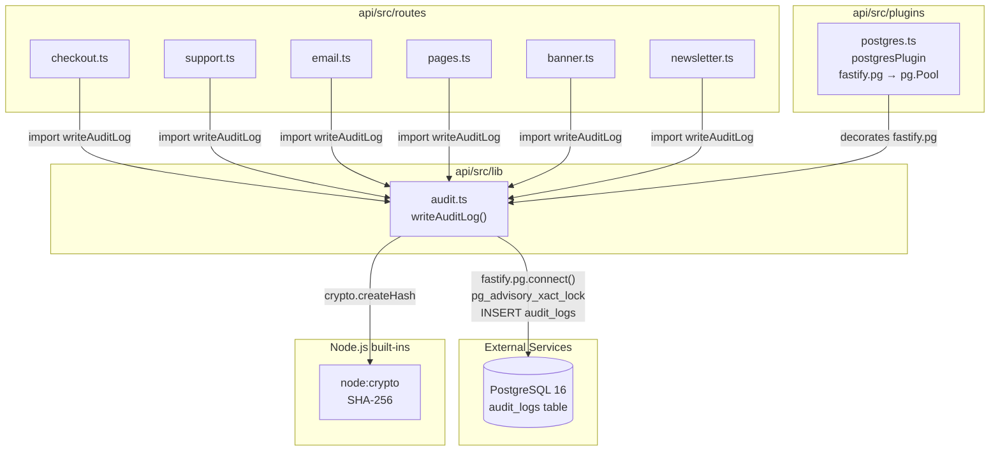

# C4 Code — api/src/lib

## Overview

- **Name**: API Library / Client Modules
- **Location**: `api/src/lib/`
- **Primary Language**: TypeScript
- **Purpose**: Utility functions for cross-cutting concerns consumed by route handlers and plugins throughout the API. Currently contains a single module responsible for tamper-evident audit logging with a cryptographic hash chain.

---

## Code Elements

### `api/src/lib/audit.ts`

#### Type: `AuditPayload` (internal, unexported)

**Location**: `api/src/lib/audit.ts:4`

```ts
type AuditPayload = {
  userEmail: string;
  userName: string;
  action:
    | 'update'
    | 'create'
    | 'delete'
    | 'send'
    | 'ban'
    | 'unblock'
    | 'order_created'
    | 'payment_success'
    | 'payment_failed';
  resourceType: string;
  resourceId?: string;
  summary: string;
  ip?: string;
  previousState?: Record<string, unknown>;
  newState?: Record<string, unknown>;
};
```

**Description**: Shape of data passed to `writeAuditLog`. `previousState` and `newState` are optional JSON blobs that capture resource state before and after a mutation for SOX-style change tracking. `resourceId` and `ip` are also optional.

---

#### Constant: `AUDIT_CHAIN_LOCK` (internal, unexported)

**Location**: `api/src/lib/audit.ts:30`

```ts
const AUDIT_CHAIN_LOCK = 7_432_918_500;
```

**Description**: A 64-bit advisory lock key passed to PostgreSQL's `pg_advisory_xact_lock()`. Serialises concurrent writers so that each new audit log entry reads the correct previous `hash` before inserting the next link in the chain. The lock is automatically released on `COMMIT` or `ROLLBACK`.

---

#### Function: `writeAuditLog`

**Location**: `api/src/lib/audit.ts:32`

```ts
export async function writeAuditLog(
  fastify: FastifyInstance,
  payload: AuditPayload,
): Promise<void>
```

**Description**: Appends one tamper-evident entry to the `audit_logs` table. The function implements a cryptographic hash chain:

1. Acquires a PostgreSQL advisory transaction lock (`AUDIT_CHAIN_LOCK`) to serialise concurrent inserts.
2. Reads the `hash` column of the most-recent existing row (falls back to the string `"genesis"` when the table is empty).
3. Computes `SHA-256( previousHash | userEmail | action | resourceType | summary )`.
4. Inserts the new row, including the computed hash, inside the same transaction.
5. On any error the transaction is rolled back and the error is re-thrown to the caller.

A dedicated database connection is checked out from `fastify.pg` (a `pg.Pool`) and released in a `finally` block regardless of outcome.

**Parameters**:

| Parameter | Type | Description |
|-----------|------|-------------|
| `fastify` | `FastifyInstance` | The Fastify application instance. Used to access the decorated `fastify.pg` connection pool. |
| `payload` | `AuditPayload` | Structured audit data. See `AuditPayload` type above. |

**Return type**: `Promise<void>`

**Throws**: Re-throws any error from the database after rolling back the transaction.

---

## Dependencies

### Internal

| Import | Source file | Purpose |
|--------|-------------|---------|
| `fastify.pg` (decorated `pg.Pool`) | `api/src/plugins/postgres.ts` | Provides the PostgreSQL connection pool. `writeAuditLog` calls `fastify.pg.connect()` to obtain a dedicated client for the transactional advisory-lock pattern. |

### External (npm)

| Package | Version | Usage |
|---------|---------|-------|
| `node:crypto` | Node.js built-in | `crypto.createHash('sha256')` — computes the SHA-256 hash for each chain link. |
| `fastify` | `^5.2.0` | `FastifyInstance` type import only; no runtime Fastify call is made inside this module. |
| `pg` | `^8.13.0` | `pg.Pool` and `pg.PoolClient` — used indirectly through `fastify.pg` decorated by `api/src/plugins/postgres.ts`. |

---

## Callers

`writeAuditLog` is imported and called from the following route files:

| File | Call sites | Action values used |
|------|------------|--------------------|
| `api/src/routes/checkout.ts` | lines 248, 348 | `order_created`, `payment_success`, `payment_failed` |
| `api/src/routes/support.ts` | line 251 | `create`, `update` |
| `api/src/routes/email.ts` | line 55 | `send` |
| `api/src/routes/pages.ts` | line 81 | `update`, `create`, `delete` |
| `api/src/routes/banner.ts` | line 82 | `update`, `create`, `delete` |
| `api/src/routes/newsletter.ts` | lines 69, 159 | `create`, `delete` |

---

## Relationships



---

## Notes

- The `api/src/lib/` directory currently contains **one file** (`audit.ts`). Modules such as `postgres.ts`, `valkey.ts`, `minio.ts`, and `mailer.ts` are co-located under `api/src/plugins/` rather than `lib/`, following a Fastify plugin registration pattern.
- The advisory-lock approach (`pg_advisory_xact_lock`) guarantees sequential hash-chain integrity without a separate serialisation table or external queue, but it does mean all audit writes contend on a single lock.
- `previousState` and `newState` are serialised to JSON strings before insertion (`JSON.stringify`), which means PostgreSQL stores them as `text` or `jsonb` depending on the column type defined in the migration.
