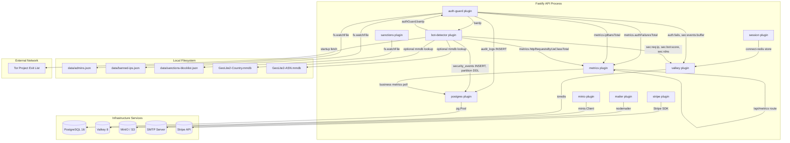

# C4 Code — api/src/plugins

## Overview

- **Name**: API Fastify Plugins
- **Location**: `api/src/plugins/`
- **Primary Language**: TypeScript
- **Purpose**: Fastify plugin registrations for cross-cutting concerns: infrastructure connectivity (database, cache, object storage), authentication/session management, payment processing, email delivery, bot detection, sanctions enforcement, and observability metrics.

All plugins are wrapped with `fastify-plugin` (`fp`) to escape Fastify's encapsulation scope, making their decorators and hooks available across the entire application instance. Plugins declare explicit `dependencies` arrays to enforce registration order.

---

## Code Elements

### `postgres.ts`

**File**: `api/src/plugins/postgres.ts`

**Registration function**: `async function postgres(fastify: FastifyInstance)`
**Exported as**: `postgresPlugin` — `fp(postgres, { name: 'postgres' })`

**What it does**:
- Creates a `pg.Pool` (node-postgres) using settings from `config.postgres`.
- Performs a connection probe (`pool.connect()` / `client.release()`) at startup to fail fast if the database is unreachable.
- Decorates the Fastify instance with `fastify.pg` (type: `pg.Pool`).
- Registers an `onClose` hook to drain the pool on shutdown (`pool.end()`).

**Fastify decorators registered**:
| Decorator | Type | Description |
|-----------|------|-------------|
| `fastify.pg` | `pg.Pool` | Shared PostgreSQL connection pool |

**Configuration options** (all sourced from `config.ts` / environment variables):
| Env var | Default | Description |
|---------|---------|-------------|
| `POSTGRES_HOST` | `localhost` | DB server hostname |
| `POSTGRES_PORT` | `5432` | DB server port |
| `POSTGRES_DB` | `shopify_stack` | Database name |
| `POSTGRES_USER` | `postgres` | DB username |
| `POSTGRES_PASSWORD` | _(empty)_ | DB password |
| `DATABASE_POOL_MAX` | `20` | Max pool connections |
| `DATABASE_POOL_IDLE_TIMEOUT` | `30000` | Idle connection timeout (ms) |
| `DATABASE_POOL_CONNECT_TIMEOUT` | `5000` | Connection acquisition timeout (ms) |

**Dependencies**: none (foundational plugin, registered first)

---

### `valkey.ts`

**File**: `api/src/plugins/valkey.ts`

**Registration function**: `async function valkey(fastify: FastifyInstance)`
**Exported as**: `valkeyPlugin` — `fp(valkey, { name: 'valkey' })`

**What it does**:
- Creates an `ioredis` `Redis` client (Valkey 8 is Redis-protocol-compatible) with `lazyConnect: true`.
- Calls `client.connect()` explicitly at startup to verify connectivity.
- Decorates the Fastify instance with `fastify.valkey`.
- Registers an `onClose` hook to gracefully disconnect (`client.quit()`).

**Fastify decorators registered**:
| Decorator | Type | Description |
|-----------|------|-------------|
| `fastify.valkey` | `ioredis.Redis` | Shared Valkey/Redis client |

**Configuration options**:
| Env var | Default | Description |
|---------|---------|-------------|
| `VALKEY_HOST` | `localhost` | Valkey server hostname |
| `VALKEY_PORT` | `6379` | Valkey server port |

**Dependencies**: none (foundational plugin)

---

### `minio.ts`

**File**: `api/src/plugins/minio.ts`

**Registration function**: `async function minio(fastify: FastifyInstance)`
**Exported as**: `minioPlugin` — `fp(minio, { name: 'minio' })`

**What it does**:
- Creates a `minio.Client` instance configured from `config.minio`.
- Probes connectivity at startup via `client.listBuckets()`.
- Decorates the Fastify instance with `fastify.minio`.
- No `onClose` hook — the MinIO client is stateless (HTTP-based).

**Fastify decorators registered**:
| Decorator | Type | Description |
|-----------|------|-------------|
| `fastify.minio` | `Minio.Client` | Shared MinIO S3-compatible object storage client |

**Configuration options**:
| Env var | Default | Description |
|---------|---------|-------------|
| `MINIO_ENDPOINT` | `localhost` | MinIO server hostname |
| `MINIO_PORT` | `9000` | MinIO server port |
| `MINIO_USE_SSL` | `false` | Enable TLS (`'true'` to activate) |
| `MINIO_ROOT_USER` | `minioadmin` | Access key ID |
| `MINIO_ROOT_PASSWORD` | _(empty)_ | Secret access key |
| `MINIO_BUCKET_FILES` | `product-files` | Bucket for downloadable product files |
| `MINIO_BUCKET_IMAGES` | `product-images` | Bucket for product images |

**Dependencies**: none (foundational plugin)

---

### `mailer.ts`

**File**: `api/src/plugins/mailer.ts`

**Registration function**: `async function mailer(fastify: FastifyInstance)`
**Exported as**: `mailerPlugin` — `fp(mailer, { name: 'mailer' })`

**What it does**:
- Creates a `nodemailer` SMTP transporter from `config.smtp`.
- Decorates the Fastify instance with `fastify.mailer` exposing a single `sendMail` method.
- Registers an `onReady` hook to verify SMTP connectivity at startup (logs a warning on failure but does not abort).
- Registers an `onClose` hook to close the SMTP transporter connection.

**Fastify decorators registered**:
| Decorator | Type | Description |
|-----------|------|-------------|
| `fastify.mailer` | `Mailer` | SMTP mail sender |

**`Mailer` interface**:
```typescript
type Mailer = {
  sendMail: (to: string, subject: string, html: string) => Promise<void>;
}
```

**Configuration options**:
| Env var | Default | Description |
|---------|---------|-------------|
| `SMTP_HOST` | `localhost` | SMTP server hostname |
| `SMTP_PORT` | `1025` | SMTP server port (1025 = Mailpit dev default) |
| `SMTP_SECURE` | `false` | Enable TLS (`'true'` to activate) |
| `SMTP_FROM` | `PixelCart <noreply@pixelcart.com>` | Envelope `From` address |

**Dependencies**: none

---

### `stripe.ts`

**File**: `api/src/plugins/stripe.ts`

**Registration function**: `async function stripe(fastify: FastifyInstance)`
**Exported as**: `stripePlugin` — `fp(stripe, { name: 'stripe' })`

**What it does**:
- Guards on `config.stripe.secretKey` — if not set, logs a warning and exits the registration function early (Stripe decorator is not added; checkout routes will fail at runtime).
- Creates a `Stripe` SDK client instance with the secret key.
- Decorates the Fastify instance with `fastify.stripe`.

**Fastify decorators registered**:
| Decorator | Type | Description |
|-----------|------|-------------|
| `fastify.stripe` | `Stripe` | Stripe API client |

**Configuration options**:
| Env var | Default | Description |
|---------|---------|-------------|
| `STRIPE_SECRET_KEY` | _(empty)_ | Stripe secret key (`sk_live_*` or `sk_test_*`) |
| `STRIPE_WEBHOOK_SECRET` | _(empty)_ | Webhook signing secret for event verification |
| `STRIPE_TAX_ENABLED` | `false` | Enable Stripe Tax automatic calculation |

**Dependencies**: none

---

### `session.ts`

**File**: `api/src/plugins/session.ts`

**Registration function**: `async function sessionSetup(fastify: FastifyInstance)`
**Exported as**: `sessionPlugin` — `fp(sessionSetup, { name: 'session', dependencies: ['valkey'] })`

**What it does**:
- Registers `@fastify/cookie` to enable cookie parsing.
- Creates a `connect-redis` `RedisStore` backed by `fastify.valkey` with key prefix `sess:`.
- Registers `@fastify/session` with the Redis store, configuring server-side sessions.
- Augments the `Session` interface (module augmentation) to declare the `user` property shape.

**Fastify decorators/hooks registered**: Session management is added to `request.session` by `@fastify/session` automatically.

**`Session.user` shape**:
```typescript
{
  email: string;
  name: string;
  picture: string;
  role: 'admin' | 'customer';
  adminTier?: 'viewer' | 'editor' | 'admin' | 'super_admin';
}
```

**Cookie configuration** (hardcoded in plugin, controlled by env):
| Setting | Value | Description |
|---------|-------|-------------|
| `maxAge` | `86400000` (24 h) | Session lifetime |
| `httpOnly` | `true` | Not accessible via JS |
| `secure` | `true` in production | HTTPS-only cookie |
| `sameSite` | `'strict'` | CSRF protection |
| `path` | `'/'` | Cookie scope |
| `saveUninitialized` | `false` | Don't persist empty sessions |

**Configuration options** (from `config.ts`):
| Env var | Default | Description |
|---------|---------|-------------|
| `SESSION_SECRET` | `dev-session-secret-...` | Cookie signing secret (required in production) |
| `NODE_ENV` | `development` | Controls `secure` flag |

**Dependencies**: `['valkey']`

---

### `auth-guard.ts`

**File**: `api/src/plugins/auth-guard.ts`

**Registration function**: `async function authGuard(fastify: FastifyInstance)`
**Exported as**: `authGuardPlugin` — `fp(authGuard, { name: 'auth-guard', dependencies: ['valkey', 'postgres', 'session', 'metrics'] })`

**What it does**:
- Loads `data/admins.json` (admin email-to-tier map) and `data/banned-ips.json` at startup; watches both files for changes with `fs.watchFile` (5 s and 1 s intervals respectively).
- Implements IPv4 and IPv6 CIDR matching for IP ban checks.
- Tracks failed login attempts per IP in Valkey (`auth:fails:<ip>`, `auth:cooldown:<ip>`). After `MAX_FAILURES` (6) failures within `COOLDOWN_SECONDS` (900 s), enters a cooldown; a subsequent attempt during cooldown triggers a permanent ban.
- Buffers `auth_fail` security events to the Valkey list `sec:events:buffer` for async flush to PostgreSQL `security_events`.
- Registers an `onRequest` hook that runs on every request:
  - Returns `403` if the requesting IP is banned.
  - Allows requests to public prefixes without a session check.
  - Returns `401` if the request is to a non-public route and has no `request.session.user`.
- Writes ban/unban events asynchronously to `audit_logs` via `fastify.pg`.
- Registers an `onClose` hook to stop file watchers.

**Public route prefixes** (exempt from session check):
```
/api/health, /api/auth/, /api/analytics/events,
/api/auth/customer/, /api/banner, /api/pages,
/api/checkout/, /api/download/
```

**Fastify decorators registered**:
| Decorator | Type | Description |
|-----------|------|-------------|
| `fastify.authGuard` | `AuthGuard` | Auth and IP ban management interface |

**`AuthGuard` interface**:
```typescript
type AuthGuard = {
  isAdminEmail: (email: string) => boolean;
  getAdminTier: (email: string) => AdminTier | null;
  isBannedIp: (ip: string) => boolean;
  recordFailedAttempt: (ip: string) => Promise<{ banned: boolean; cooldown: boolean; remaining: number }>;
  banIp: (ip: string, reason: string) => void;
  unbanIp: (ip: string) => boolean;
  getBannedList: () => BannedIp[];
  reloadBannedIps: () => void;
}
```

**`AdminTier` privilege ladder** (ordered low to high):
```
viewer < editor < admin < super_admin
```

**Valkey keys used**:
| Key pattern | TTL | Purpose |
|-------------|-----|---------|
| `auth:fails:<ip>` | 900 s | Failed attempt counter per IP |
| `auth:cooldown:<ip>` | 1800 s | Cooldown flag after reaching max failures |
| `sec:events:buffer` | none | Append-only list of security events for async DB flush |

**Hooks registered**:
| Hook | Purpose |
|------|---------|
| `onRequest` | IP ban check + unauthenticated route guard |
| `onClose` | Unwatch admin/ban files |

**Dependencies**: `['valkey', 'postgres', 'session', 'metrics']`

---

### `sanctions.ts`

**File**: `api/src/plugins/sanctions.ts`

**Registration function**: `async function sanctionsGuard(fastify: FastifyInstance)`
**Exported as**: `sanctionsPlugin` — `fp(sanctionsGuard, { name: 'sanctions' })`

**What it does**:
- Loads `data/sanctions-blocklist.json` (array of `BlocklistEntry` objects) at startup; watches the file with `fs.watchFile` (5 s interval) for live reloads.
- Maintains two in-memory sets: `blockedEmails` and `blockedDomains` for O(1) lookup.
- `isBlocked(email)` returns `true` if the full email OR its domain is on the list.
- `addEntry` / `removeEntry` update both the in-memory sets and immediately write back to disk.
- Registers an `onClose` hook to stop the file watcher.
- No Fastify hooks — purely a decorator consulted by route handlers (e.g., checkout, auth).

**Fastify decorators registered**:
| Decorator | Type | Description |
|-----------|------|-------------|
| `fastify.sanctions` | `SanctionsGuard` | Email/domain blocklist guard |

**`SanctionsGuard` interface**:
```typescript
type SanctionsGuard = {
  isBlocked: (email: string) => boolean;
  addEntry: (entry: Omit<BlocklistEntry, 'addedAt'>) => void;
  removeEntry: (value: string) => boolean;
  getList: () => BlocklistEntry[];
}
```

**`BlocklistEntry` shape**:
```typescript
type BlocklistEntry = {
  value: string;          // email address or domain name
  type: 'email' | 'domain';
  reason: string;
  addedAt: string;        // ISO 8601 timestamp
}
```

**Dependencies**: none

---

### `metrics.ts`

**File**: `api/src/plugins/metrics.ts`

**Registration function**: `async function metrics(fastify: FastifyInstance)`
**Exported as**: `metricsPlugin` — `fp(metrics, { name: 'metrics' })`

**What it does**:
- Creates a `prom-client` `Registry` with service label `service: 'shopify-stack-api'`.
- Registers Node.js default metrics (`collectDefaultMetrics`).
- Defines Prometheus instruments (histograms, counters, gauges) for HTTP, security, and business metrics.
- Polls PostgreSQL every 60 s (`onReady` → `setInterval`) to update business metric gauges (revenue, orders, AOV, gross profit, products, customers) across five time periods (24h, 7d, 30d, 90d, 365d).
- Registers an `onResponse` hook to record HTTP request duration and total count (skips the `/api/metrics` route itself to avoid self-measurement).
- Exposes a `GET /api/metrics` route that returns Prometheus-format metrics; access is restricted to authenticated admin sessions.
- Registers an `onClose` hook to clear the business metrics polling interval.

**Fastify decorators registered**:
| Decorator | Field | Type | Description |
|-----------|-------|------|-------------|
| `fastify.metrics` | `registry` | `Registry` | prom-client registry |
| | `serviceUp` | `Gauge` | Infrastructure service health gauge |
| | `authFailuresTotal` | `Counter` | Auth failure events (label: `reason`) |
| | `rateLimitHitsTotal` | `Counter` | 429 rate limit hits (label: `endpoint`) |
| | `ipBansTotal` | `Counter` | IP bans issued |
| | `httpRequestsByUaClassTotal` | `Counter` | Requests by UA class (labels: `ua_class`, `method`) |

**Prometheus instruments defined** (full list):
| Name | Type | Labels | Description |
|------|------|--------|-------------|
| `http_request_duration_seconds` | Histogram | `method`, `route`, `status_code` | Request latency |
| `http_requests_total` | Counter | `method`, `route`, `status_code` | Total request count |
| `service_up` | Gauge | `service_name` | Infrastructure health (1/0) |
| `auth_failures_total` | Counter | `reason` | Auth failures |
| `rate_limit_hits_total` | Counter | `endpoint` | 429 responses |
| `ip_bans_total` | Counter | — | IP bans issued |
| `http_requests_by_ua_class_total` | Counter | `ua_class`, `method` | Requests by UA class |
| `store_revenue_cents` | Gauge | `period` | Revenue by period |
| `store_orders_total` | Gauge | `period` | Order count by period |
| `store_avg_order_value_cents` | Gauge | `period` | AOV by period |
| `store_gross_profit_cents` | Gauge | `period` | Gross profit by period |
| `store_products_total` | Gauge | `status` | Products by status |
| `store_customers_total` | Gauge | — | Unique customers |

**Hooks registered**:
| Hook | Purpose |
|------|---------|
| `onReady` | Start business metrics polling (every 60 s) |
| `onResponse` | Record HTTP duration and request count |
| `onClose` | Clear business metrics polling interval |

**Routes registered**:
| Method | Path | Auth | Description |
|--------|------|------|-------------|
| `GET` | `/api/metrics` | Admin session required | Prometheus scrape endpoint |

**Dependencies**: none (but uses `fastify.pg` which must be registered first in practice)

---

### `bot-detector.ts`

**File**: `api/src/plugins/bot-detector.ts`

**Registration function**: `async function botDetector(fastify: FastifyInstance)`
**Exported as**: `botDetectorPlugin` — `fp(botDetector, { name: 'bot-detector', dependencies: ['valkey', 'postgres', 'metrics', 'auth-guard'] })`

**What it does**:
- At startup, loads optional MaxMind GeoLite2 `.mmdb` databases (`GeoLite2-Country.mmdb`, `GeoLite2-ASN.mmdb`) from the project root using a dynamic `import('maxmind')`. Operates gracefully if files are absent.
- Fetches the Tor Project's bulk exit node list (`https://check.torproject.org/torbulkexitlist`) non-blockingly at startup.
- Registers an `onRequest` hook that runs for every request, performing:
  1. **Request rate tracking**: Increments per-IP request counter (`sec:req:ip:<ip>`) and global request counter (`sec:counter:req`) in Valkey with 60 s TTL; adds IP to seen-IPs set (`sec:seen_ips`). Also tracks per-ASN rate (`sec:req:asn:<asn>`) when ASN data is available.
  2. **UA classification**: Classifies the `User-Agent` header as `browser`, `good_bot`, `library`, `empty`, or `unknown`.
  3. **Honeypot detection**: If the requested path matches a honeypot path (`/wp-login.php`, `/.env`, `/admin.php`, etc.), sets bot score to `1.0`, buffers a `honeypot` security event, and immediately calls `fastify.authGuard.banIp()`.
  4. **Signals gathering and bot scoring**: Combines UA class, header presence (`Accept`, `Accept-Language`), previous honeypot flag, suspicious-checkout-speed flag (`sec:checkout_fast:<ip>`), rDNS spoof check (for `good_bot` UAs only, cached in Valkey for 5 min), Tor exit node membership, datacenter ASN membership, and inter-arrival time (IAT) uniformity into a `0.0–1.0` bot score.
  5. **Action on score**: Caches scores ≥ 0.20 in Valkey. Scores ≥ 0.60 buffer a `bot_flag` event. Scores ≥ 0.85 trigger an immediate `fastify.authGuard.banIp()`.
- Registers an `onReady` hook that starts three background intervals:
  - **Attack detection** (every 30 s): Reads 429-rate and unique-IP count from Valkey; sets `sec:attacks:active` to `ELEVATED` or `ATTACK` (with 5 min TTL) when thresholds are exceeded.
  - **Event flush** (every 5 s): Atomically renames `sec:events:buffer` to a flushing key, batch-inserts up to 5 000 events into PostgreSQL `security_events`, manages monthly table partitions (creates current + next month).
  - **Retention cleanup** (every 24 h): Drops `security_events_YYYY_MM` partitions older than 90 days.
- Registers an `onClose` hook to clear all three intervals.

**Bot score signals**:
| Signal | Score contribution | Notes |
|--------|--------------------|-------|
| UA class `empty` or `library` | +0.30 | No or automation-style UA |
| Missing `Accept` header | +0.15 | |
| Missing `Accept-Language` header | +0.10 | |
| Honeypot path hit | +0.60 | |
| rDNS spoof (good-bot UA without matching PTR) | +0.50 | Cached in Valkey |
| Tor exit node | +0.40 | |
| Datacenter ASN | +0.20 | 12 known ASNs (DO, AWS, GCP, Azure, etc.) |
| Metronomic IAT (CV < 0.1, mean < 2 s) | +0.15 | Sliding window of last 10 requests |
| Fast checkout (PI created < 5 s ago) | +0.30 | Flag set by checkout route |

**Honeypot paths**:
```
/wp-login.php, /.env, /admin.php, /xmlrpc.php, /setup.php,
/phpMyAdmin*, /wp-admin*
```

**Valkey keys used**:
| Key pattern | TTL | Purpose |
|-------------|-----|---------|
| `sec:req:ip:<ip>` | 60 s | Per-IP request counter |
| `sec:req:asn:<asn>` | 60 s | Per-ASN request counter |
| `sec:seen_ips` | 60 s | Set of unique IPs seen in last 60 s |
| `sec:counter:req` | 60 s | Total request counter |
| `sec:counter:429` | 60 s | 429-response counter |
| `sec:honeypot:<ip>` | 86400 s | Honeypot hit flag |
| `sec:checkout_fast:<ip>` | varies | Fast-checkout flag (set by checkout route) |
| `sec:bot:score:<ip>` | 300 s | Computed bot score |
| `sec:rdns:<ip>` | 300 s | rDNS spoof check result cache |
| `sec:iat:<ip>` | 60 s | Inter-arrival time sliding window list |
| `sec:events:buffer` | none | Pending security events list |
| `sec:attacks:active` | 300 s | Current attack severity |
| `sec:attack:start` | 86400 s | Attack start timestamp |

**Hooks registered**:
| Hook | Purpose |
|------|---------|
| `onRequest` | Per-request rate tracking, UA classification, bot scoring, honeypot |
| `onReady` | Start attack detection, event flush, and partition cleanup intervals |
| `onClose` | Clear all three background intervals |

**Dependencies**: `['valkey', 'postgres', 'metrics', 'auth-guard']`

---

## Dependencies

### Internal dependencies

| Plugin | Internal modules consumed |
|--------|--------------------------|
| All plugins | `api/src/config.ts` — centralised environment-variable configuration |
| `auth-guard.ts` | `fastify.valkey`, `fastify.pg`, `fastify.metrics` (via Fastify decorators) |
| `bot-detector.ts` | `fastify.valkey`, `fastify.pg`, `fastify.metrics`, `fastify.authGuard` |
| `metrics.ts` | `fastify.pg` |
| `session.ts` | `fastify.valkey` |

### External package dependencies

| Plugin | npm package | Purpose |
|--------|-------------|---------|
| `postgres.ts` | `pg` | PostgreSQL client |
| `valkey.ts` | `ioredis` | Redis/Valkey client |
| `minio.ts` | `minio` | S3-compatible object storage client |
| `mailer.ts` | `nodemailer` | SMTP mail transport |
| `stripe.ts` | `stripe` | Stripe Payments SDK |
| `session.ts` | `@fastify/cookie`, `@fastify/session`, `connect-redis` | Cookie parsing, server-side sessions, Redis session store |
| `metrics.ts` | `prom-client` | Prometheus metrics instrumentation |
| `bot-detector.ts` | `maxmind` _(optional, lazy import)_ | IP geolocation and ASN lookup |
| All | `fastify-plugin` (`fp`) | Plugin encapsulation escape hatch |

### Runtime external service dependencies

| Plugin | External service | Protocol |
|--------|-----------------|----------|
| `postgres.ts` | PostgreSQL 16 | TCP (5432) |
| `valkey.ts` | Valkey 8 (Redis-compatible) | TCP (6379) |
| `minio.ts` | MinIO (S3-compatible) | HTTP/HTTPS (9000) |
| `mailer.ts` | SMTP server (Mailpit in dev) | SMTP (1025 dev / 465/587 prod) |
| `stripe.ts` | Stripe API (`api.stripe.com`) | HTTPS |
| `session.ts` | Valkey (via `fastify.valkey`) | TCP (6379) |
| `bot-detector.ts` | Tor Project (`check.torproject.org`) | HTTPS (at startup only) |
| `bot-detector.ts` | MaxMind `.mmdb` files | Local filesystem (optional) |
| `bot-detector.ts` / `auth-guard.ts` | `data/admins.json`, `data/banned-ips.json`, `data/sanctions-blocklist.json` | Local filesystem |

---

## Plugin Registration Order

Fastify resolves plugin `dependencies` at registration time. The required order is:

```
postgres  ──┐
valkey    ──┼──► session ──► auth-guard ──► bot-detector
minio     ──┘
mailer
stripe
metrics   ──────────────────► auth-guard ──► bot-detector
```

Concretely:
1. `metrics` (no deps)
2. `postgres` (no deps)
3. `valkey` (no deps)
4. `minio` (no deps)
5. `mailer` (no deps)
6. `stripe` (no deps)
7. `session` (needs `valkey`)
8. `auth-guard` (needs `valkey`, `postgres`, `session`, `metrics`)
9. `bot-detector` (needs `valkey`, `postgres`, `metrics`, `auth-guard`)
10. `sanctions` (no deps — can go anywhere)

---

## Relationships



---

## Key Design Decisions

**CONFIRMED** — All plugins use `fastify-plugin` (`fp`) to break out of Fastify's encapsulation, making decorators globally visible.

**CONFIRMED** — `auth-guard` and `bot-detector` cooperate bidirectionally: `bot-detector` calls `fastify.authGuard.banIp()` for high-confidence bots and honeypot hits; `auth-guard` records failed auth events to the same Valkey buffer that `bot-detector` flushes to PostgreSQL.

**CONFIRMED** — The `metrics` plugin is registered before the security plugins so that `fastify.metrics.authFailuresTotal` and `fastify.metrics.ipBansTotal` are available to `auth-guard`, and `fastify.metrics.httpRequestsByUaClassTotal` is available to `bot-detector`.

**CONFIRMED** — `bot-detector` uses a two-key atomic buffer flush pattern (`sec:events:buffer` → `sec:events:buffer:flushing` via `RENAME`) to avoid data loss if a flush cycle fails mid-way.

**CONFIRMED** — The `maxmind` package and `.mmdb` files are optional; the plugin degrades gracefully with a startup warning if they are absent.

**CONFIRMED** — `session` stores server-side session data in Valkey under the `sess:` key prefix using `connect-redis`.
