# C4 Code — api/src/routes

## Overview

- **Name**: API Route Handlers
- **Location**: `api/src/routes/`
- **Primary Language**: TypeScript (compiled/run via `tsx`)
- **Purpose**: HTTP endpoint handlers for all API functionality — authentication, checkout, downloads, analytics, security monitoring, content management, support, and compliance tooling.

All route files export a single async registration function that receives a `FastifyInstance` and registers one or more routes on it. Routes are mounted without a common prefix inside each file; every path is fully qualified (e.g. `/api/auth/google`).

---

## Code Elements

### `auth.ts`

**File**: `api/src/routes/auth.ts`

**Registration function**: `export async function authRoutes(fastify: FastifyInstance)`

Handles Google OAuth 2.0 login for both admin and customer roles, a development-only direct-login bypass, session introspection, and logout.

#### Endpoints

**`GET /api/auth/google`**
- Auth required: none (public)
- Rate limit: 5 attempts per IP per 15 minutes (Valkey counter `oauth:admin:rl:<ip>`)
- Behaviour: generates a 16-byte hex nonce, stores it in Valkey with a 5-minute TTL (`oauth:nonce:<nonce>` = `"admin"`), then redirects the client to Google's OAuth consent screen with `state = { role: "admin", nonce }`.

**`GET /api/auth/customer/google`**
- Auth required: none (public)
- Rate limit: none (customer flow)
- Behaviour: same nonce-generation flow as admin but stores `"customer"` and redirects with `role: "customer"`.

**`GET /api/auth/google/callback`**
- Auth required: none (public)
- Query params: `code` (string), `error` (string), `state` (JSON string `{ role, nonce }`)
- Behaviour:
  1. Parses and validates `state`; redirects to error path on failure.
  2. Atomically consumes the nonce via Valkey `GETDEL`; rejects replayed or invalid nonces.
  3. Exchanges the OAuth code for tokens via `google-auth-library`.
  4. Verifies the ID token and extracts `email`.
  5. For admin role: verifies the email is in `authGuard.isAdminEmail()`; determines `adminTier` via `authGuard.getAdminTier()`.
  6. Records failed attempts via `authGuard.recordFailedAttempt()` — after `MAX_FAILURES` triggers a 15-minute cooldown; a subsequent attempt during cooldown results in a permanent ban.
  7. On success: writes `request.session.user = { email, name, picture, role, [adminTier] }` and redirects to `/account` (customer) or `/admin/` (admin).
- Response: 302 redirect (success or error)

**`POST /api/auth/dev-login`** _(development only — only registered when `NODE_ENV === "development"`)_
- Auth required: none
- Request body: `{ email?: string; role?: "admin" | "customer" }`
- Behaviour: writes a session directly, bypassing OAuth. Enforces the admin email list and IP ban check.
- Response: `{ ok: true }`

**`GET /api/auth/me`**
- Auth required: active session (any role)
- Behaviour: returns the session user object.
- Response: `{ user: { email, name, picture, role, adminTier? } }` or `401 { error: "Unauthorized" }`

**`POST /api/auth/logout`**
- Auth required: none (session destroyed regardless)
- Behaviour: calls `request.session.destroy()`.
- Response: `{ ok: true }`

---

### `checkout.ts`

**File**: `api/src/routes/checkout.ts`

**Registration function**: `export async function checkoutRoutes(fastify: FastifyInstance)`

Manages the complete purchase lifecycle: configuration, payment intent creation, Stripe webhook ingestion, and order retrieval for the success page.

#### Endpoints

**`GET /api/checkout/config`**
- Auth required: none (public)
- Behaviour: returns whether Stripe Tax is enabled.
- Response: `{ taxEnabled: boolean }`

**`POST /api/checkout/create-payment-intent`**
- Auth required: none (public, but rate-limited)
- Rate limit: 10 requests per IP per 60 seconds (Valkey multi-exec counter)
- Request body:
  ```
  {
    items: Array<{ productId: string; quantity: number }>,
    email: string,
    billingAddress?: {
      country: string,   // 2-letter ISO code, required when taxEnabled
      state?: string,    // required for country=US
      postalCode?: string // required for country=US
    }
  }
  ```
- Behaviour:
  1. Validates `email` format and non-empty `items`.
  2. Screens `email` against the OFAC/sanctions list via `fastify.sanctions.isBlocked()` (silent block — does not reveal blocklist membership).
  3. Enforces per-IP rate limit; emits security events to Valkey buffer on breach.
  4. Validates cart items via `validateCartItems()` from `products.ts`.
  5. AML velocity check: counts orders from the same email in the past 60 minutes; flags (does not block) if `>= 5`.
  6. If `taxEnabled`: calls Stripe Tax Calculations API (`tax_code: txcd_10201000`).
  7. Inserts an `orders` row (`status: 'pending'`, `payment_status: 'pending'`) and `order_items` rows; retries up to 3 times on `23505` (duplicate order number).
  8. Creates a Stripe `PaymentIntent` with idempotency key `pi_<orderId>`.
  9. Writes an `order_created` entry to the chained audit log.
- Response: `{ clientSecret, orderId, orderToken, subtotal, taxAmount, grandTotal }` (all monetary values in cents)

**`POST /api/checkout/webhook`** _(registered in a sub-plugin that overrides content-type parser to receive raw buffer for signature verification)_
- Auth required: Stripe webhook signature (`stripe-signature` header verified against `config.stripe.webhookSecret`)
- Request body: raw `Buffer` (not parsed JSON)
- Behaviour (only `payment_intent.succeeded` is handled):
  1. Verifies HMAC signature; rejects with `400` on failure.
  2. Detects "checkout too fast" anomaly (PI created and succeeded within 5 seconds) — flags the source IP in Valkey and emits a `bot_flag` security event.
  3. Updates `orders SET status = 'paid', payment_status = 'paid'`.
  4. Fetches order + items and writes a `payment_success` audit log entry with before/after state.
  5. Sends an HTML confirmation email via `fastify.mailer` (HTML-escapes all interpolated values).
- Response: `{ received: true }` (HTTP 200)

**`GET /api/checkout/order/:id`**
- Auth required: none (token-gated)
- Path params: `id` (UUID v4 pattern)
- Query params: `token` (string — `order_token` UUID issued at order creation)
- Behaviour:
  1. Validates `id` format.
  2. Fetches the order and its items with a single `JOIN` query.
  3. Performs constant-time token comparison (`crypto.timingSafeEqual`) to prevent timing attacks.
  4. If status is `'paid'`, generates signed proxy download URLs (`/api/download/:orderId/:productId?token=<orderToken>`).
- Response: `{ id, orderNumber, email, status, paymentStatus, total, taxAmount, items, downloadLinks, createdAt }`

---

### `download.ts`

**File**: `api/src/routes/download.ts`

**Registration function**: `export async function downloadRoutes(fastify: FastifyInstance)`

Serves digital product files as short-lived presigned MinIO redirects, gated by order token and order status.

#### Endpoints

**`GET /api/download/:orderId/:productId`**
- Auth required: none (token-gated)
- Path params: `orderId` (UUID), `productId` (string)
- Query params: `token` (string)
- Behaviour:
  1. Validates `orderId` format.
  2. Fetches `orders.status` and `orders.order_token` for the order.
  3. Constant-time token comparison.
  4. Revocation check: returns `402` if `status !== 'paid'` (instant effect on chargeback/refund).
  5. Verifies the `productId` belongs to this order via `order_items` lookup.
  6. Generates a 5-minute presigned GET URL for MinIO object `<productId>/download.zip` in bucket `config.minio.bucketFiles`.
- Response: `302` redirect to presigned URL, or `401/402/403/404` errors.

---

### `health.ts`

**File**: `api/src/routes/health.ts`

**Registration function**: `export async function healthRoutes(fastify: FastifyInstance)`

#### Endpoints

**`GET /api/health`**
- Auth required: none (public). Admins receive per-service detail; public callers receive pass/fail only.
- Behaviour:
  1. Runs `pg.query('SELECT 1')`, `valkey.ping()`, and `minio.listBuckets()` concurrently via `Promise.allSettled`.
  2. Updates Prometheus gauges `serviceUp{service_name}` for each dependency.
  3. Returns `200` when all three are up; `503` otherwise.
- Response (public): `{ status: "ok" | "degraded" }`
- Response (admin session): `{ status: "ok" | "degraded", services: { postgres, valkey, minio } }`

---

### `analytics.ts`

**File**: `api/src/routes/analytics.ts`

**Registration function**: `export async function analyticsRoutes(fastify: FastifyInstance)`

Receives anonymous front-end behavioural events and serves aggregated behaviour reports to admins.

#### Endpoints

**`POST /api/analytics/events`**
- Auth required: none (public)
- Rate limit: 60 requests per IP per 60 seconds
- Request body:
  ```
  {
    events: Array<{
      type: "page_view" | "scroll_depth" | "click" | "element_visibility" | "page_exit",
      sessionId: string,  // UUID v4
      path: string,       // must start with "/"
      timestamp: number,  // Unix ms
      data: Record<string, unknown>  // max 2048 bytes when JSON-serialised
    }>
  }
  ```
  Max 50 events per batch. Invalid events are silently dropped; the batch still succeeds if at least one event is valid.
- Behaviour: bulk-inserts valid events into `analytics_events` table with a derived `page_type` column.
- Response: `204 No Content`

**`GET /api/analytics/behavior`**
- Auth required: active session (any role)
- Query params: `start` (ISO date string), `end` (ISO date string)
- Behaviour: runs 6 parallel PostgreSQL queries against `analytics_events`:
  1. Summary: total page views, unique sessions, avg time on page, avg scroll depth.
  2. Page views time series (bucketed by day or week based on range length; day if <= 60 days).
  3. Top 20 pages by view count with engagement metrics.
  4. Scroll depth distribution by page type.
  5. Top 30 clicked elements with text, tag, href, and page.
  6. Top 20 element visibility impressions with avg visible duration.
- Response: `{ summary, pageViews[], topPages[], scrollDepth[], topClicks[], elementVisibility[] }`

---

### `security.ts`

**File**: `api/src/routes/security.ts`

**Registration function**: `export { securityRoutesImpl as securityRoutes }`

Registers honeypot traps and the security operations dashboard/report/block API. Requires `admin` tier `>= "admin"` for all management endpoints.

#### Endpoints

**Honeypot — `GET|POST /wp-login.php`, `GET|POST /.env`, `GET|POST /admin.php`, `GET|POST /xmlrpc.php`, `GET|POST /setup.php`**
- Auth required: none
- Behaviour: logs the hit and returns `404`. The `bot-detector` plugin reads these hits from the Valkey buffer and may ban the requesting IP.
- Response: `404 { error: "Not found" }`

**Honeypot wildcard — `GET /phpMyAdmin/*`, `GET /wp-admin/*`**
- Auth required: none
- Behaviour: same as above.
- Response: `404 { error: "Not found" }`

**`GET /api/security/dashboard`**
- Auth required: admin session, tier `>= "admin"`
- Behaviour: assembles a multi-panel security dashboard from Valkey counters and 8 parallel PostgreSQL queries (gracefully degrades if `security_events` table is absent):
  - Panel 2: Hourly event timeline (24 hours)
  - Panel 3: Top 20 threat actors by request count (last 5 minutes)
  - Panel 4: Blocked traffic breakdown by reason, country, and UA class (24 hours)
  - Panel 5: Rate-limit hits by endpoint (24 hours)
  - Panel 6: Bot detection feed — events with bot_score >= 0.5 (24 hours, limit 100)
  - Panel 7: Auth fail count (last hour) + recent ban/unblock entries from `audit_logs`
  - Panel 8: Checkout attempts vs. paid orders (24 hours)
  - Panel 9: Valkey memory usage (MB) and active PostgreSQL connections
- Response: `{ degraded, attackStatus, attackDurationMinutes, stats, bannedIps, recentEvents, topThreatActors, rateLimitByEndpoint, blockedBreakdown, authStats, eventTimeline, infraStats, checkoutStats }`

**`GET /api/security/report`**
- Auth required: admin session, tier `>= "admin"`
- Query params: `start` (ISO date, defaults to 24 hours ago), `end` (ISO date, defaults to now)
- Max range: 90 days
- Behaviour: generates a structured security report with 6 parallel queries covering executive summary, hourly attack timeline, top 50 threat actors, event breakdown by type, rate-limit/auth events by endpoint, and bot traffic UA classification. Auto-generates actionable tasks based on thresholds.
- Response: `{ period, generatedAt, preparedFor, gdprNote, summary, attackTimeline[], topThreatActors[], rateLimitAndAuthEvents[], botTrafficBreakdown[], eventsByType[], infraAlerts, actionableTasks[] }`

**`POST /api/security/block`**
- Auth required: admin session, tier `>= "admin"`
- Request body: `{ ip: string, reason?: string }` — `ip` may be IPv4, IPv6, or CIDR notation
- Behaviour:
  1. Validates IP/CIDR format.
  2. Refuses to block the requester's own IP.
  3. Calls `fastify.authGuard.banIp()` — persists to `data/banned-ips.json` and updates in-memory set.
  4. Inserts a `ban` entry into `audit_logs`.
- Response: `201 { ok: true }` or `409` if already blocked.

**`DELETE /api/security/block/:ip`**
- Auth required: admin session, tier `>= "admin"`
- Path params: `ip` (URL-encoded IP or CIDR)
- Behaviour:
  1. Calls `fastify.authGuard.unbanIp()` — removes from `banned-ips.json` and in-memory set immediately.
  2. Inserts an `unblock` entry into `audit_logs`.
- Response: `{ ok: true }` or `404` if not in ban list.

---

### `audit.ts`

**File**: `api/src/routes/audit.ts`

**Registration function**: `export async function auditRoutes(fastify: FastifyInstance)`

Provides paginated read-only access to the chained audit log for admin users.

#### Endpoints

**`GET /api/audit/logs`**
- Auth required: admin session, tier `>= "admin"`
- Query params: `page` (integer, default 1), `limit` (integer, 1–100, default 50), `resource_type` (one of: `banner`, `page`, `support_ticket`, `email_campaign`, `newsletter`, `subscriber`)
- Behaviour: queries `audit_logs` with optional `resource_type` filter; returns paginated results ordered by `created_at DESC`.
- Response: `{ logs[], total, page, totalPages }`

---

### `support.ts`

**File**: `api/src/routes/support.ts`

**Registration function**: `export async function supportRoutes(fastify: FastifyInstance)`

Full support ticket lifecycle for customers and admin agents (editor tier+).

#### Endpoints

**`POST /api/support/tickets`**
- Auth required: any authenticated session
- Request body: `{ subject: string (max 500), body: string (max 5000), priority?: "low"|"medium"|"high" }`
- Behaviour: creates a `support_tickets` row and an initial `ticket_messages` row in one transaction. Default priority is `"medium"`.
- Response: `201 { id, subject, status, priority, createdAt }`

**`GET /api/support/tickets`**
- Auth required: any authenticated session
- Query params: `status` (`open|in_progress|resolved|closed`), `customer_email` (admin only)
- Behaviour: customers see only their own tickets; admins see all (with optional customer_email filter). Orders by `updated_at DESC`.
- Response: `{ tickets[] }`

**`GET /api/support/tickets/:id`**
- Auth required: any authenticated session
- Path params: `id` (integer)
- Behaviour: returns ticket + all messages. Customers can only access their own tickets (returns `404` for others — no information leakage). Admins with tier `>= "editor"` can access any ticket.
- Response: `{ ticket, messages[] }`

**`POST /api/support/tickets/:id/messages`**
- Auth required: any authenticated session
- Path params: `id` (integer)
- Request body: `{ body: string (max 5000) }`
- Behaviour: appends a message; touches `support_tickets.updated_at`. Returns `400` if ticket is `closed`. Customers can only post to their own tickets.
- Response: `201 { ok: true }`

**`PATCH /api/support/tickets/:id`**
- Auth required: admin session, tier `>= "editor"`
- Path params: `id` (integer)
- Request body: `{ status?: "open"|"in_progress"|"resolved"|"closed", priority?: "low"|"medium"|"high" }`
- Behaviour: updates ticket status and/or priority; writes an `update` audit log entry.
- Response: `{ id, status, priority, updatedAt }`

---

### `email.ts`

**File**: `api/src/routes/email.ts`

**Registration function**: `export async function emailRoutes(fastify: FastifyInstance)`

Admin email campaign dispatch. Restricted to the highest privilege tier.

#### Endpoints

**`POST /api/email/send`**
- Auth required: admin session, tier must be exactly `"super_admin"`
- Request body:
  ```
  {
    recipients: Array<{ email: string; name: string }>,
    subject: string,
    body: string
  }
  ```
- Behaviour: iterates recipients and calls `fastify.mailer.sendMail()` for each; failures per recipient are collected but do not abort the batch. Writes a `send` audit log entry summarising how many succeeded/failed.
- Response: `{ sent, failed, errors?: string[] }`

---

### `newsletter.ts`

**File**: `api/src/routes/newsletter.ts`

**Registration function**: `export async function newsletterRoutes(fastify: FastifyInstance)`

Newsletter subscription management backed by `data/newsletter.json` (flat-file persistence).

#### Endpoints

**`GET /api/newsletter/settings`**
- Auth required: none (public)
- Behaviour: reads `data/newsletter.json` and returns enabled flag.
- Response: `{ enabled: boolean }`

**`PUT /api/newsletter/settings`**
- Auth required: admin session, tier `>= "editor"`
- Request body: `{ enabled: boolean }`
- Behaviour: updates `data/newsletter.json`; writes an `update` audit log entry.
- Response: `{ enabled: boolean }`

**`POST /api/newsletter/subscribe`**
- Auth required: none (public), but authenticated customers may only subscribe their own email
- Rate limit: 5 requests per IP per 60 seconds
- Request body: `{ email: string }`
- Behaviour: validates email format, normalises to lowercase, checks rate limit, checks newsletter is enabled, deduplicates, appends to `newsletter.json`.
- Response: `{ ok: true, message: "Subscribed successfully" | "Already subscribed" }` or `400/429`

**`GET /api/newsletter/subscribers`**
- Auth required: admin session (any tier)
- Behaviour: returns full subscriber list and count.
- Response: `{ subscribers[], enabled, total }`

**`DELETE /api/newsletter/subscribers/:email`**
- Auth required: admin session, tier `>= "editor"`
- Path params: `email` (URL-encoded)
- Behaviour: removes subscriber from `newsletter.json`; writes a `delete` audit log entry.
- Response: `{ ok: true }` or `404`

---

### `banner.ts`

**File**: `api/src/routes/banner.ts`

**Registration function**: `export async function bannerRoutes(fastify: FastifyInstance)`

Storefront announcement banner backed by `data/banner.json`.

#### Endpoints

**`GET /api/banner`**
- Auth required: none (public)
- Behaviour: reads and returns the current banner state.
- Response: `{ active, text, imageUrl, linkUrl, linkLabel, updatedAt }`

**`PUT /api/banner`**
- Auth required: admin session, tier `>= "editor"`
- Request body: `{ active: boolean, text: string, imageUrl?: string, linkUrl?: string, linkLabel?: string }`
- Behaviour: validates `active` is boolean; validates `text` is non-empty when `active = true`; persists to `data/banner.json`; writes an `update` audit log entry.
- Response: the saved `BannerData` object.

---

### `pages.ts`

**File**: `api/src/routes/pages.ts`

**Registration function**: `export async function pagesRoutes(fastify: FastifyInstance)`

Under-construction toggle for known content pages, backed by `data/pages.json`. Known slugs: `privacy-policy`, `terms-of-service`, `refund-policy`, `changelog`, `roadmap`.

#### Endpoints

**`GET /api/pages`**
- Auth required: none (public)
- Behaviour: reads and returns the full pages state map.
- Response: `{ pages: Record<slug, { underConstruction }>, updatedAt }`

**`PUT /api/pages/:slug`**
- Auth required: admin session, tier `>= "editor"`
- Path params: `slug` (one of the five known slugs; returns `404` for unknown slugs)
- Request body: `{ underConstruction: boolean }`
- Behaviour: updates `data/pages.json` for the given slug; writes an `update` audit log entry.
- Response: `{ slug, underConstruction, updatedAt }`

---

### `reconciliation.ts`

**File**: `api/src/routes/reconciliation.ts`

**Registration function**: `export async function reconciliationRoutes(fastify: FastifyInstance)`

Daily payment reconciliation comparing local paid orders against Stripe PaymentIntents.

#### Endpoints

**`GET /api/admin/reconciliation`**
- Auth required: admin session, tier `>= "admin"`
- Query params: `date` (YYYY-MM-DD, defaults to today UTC)
- Behaviour:
  1. Fetches all orders with `payment_status = 'paid'` for the day.
  2. Fetches all `payment_intent.succeeded` PI objects from Stripe for the same day (limit 100).
  3. Cross-references the two sets and identifies three discrepancy types:
     - `missing_in_db`: PI succeeded in Stripe but no matching paid order.
     - `pi_not_succeeded`: Order marked paid but PI not in Stripe's succeeded list.
     - `amount_mismatch`: Both sides found but amounts differ.
     - `no_stripe_reference`: Order marked paid but has no `stripe_payment_intent_id`.
- Response: `{ date, generatedAt, summary: { dbPaidOrders, stripeSucceededPIs, discrepancyCount }, discrepancies[], status: "CLEAN"|"DISCREPANCIES_FOUND" }`

---

## API Endpoints Summary Table

| Method | Path | Auth | Description |
|--------|------|------|-------------|
| GET | `/api/auth/google` | None | Initiate admin Google OAuth (rate-limited 5/15min/IP) |
| GET | `/api/auth/customer/google` | None | Initiate customer Google OAuth |
| GET | `/api/auth/google/callback` | None | Google OAuth callback; issues session |
| POST | `/api/auth/dev-login` | None (dev only) | Direct login bypass for development |
| GET | `/api/auth/me` | Session | Return current session user |
| POST | `/api/auth/logout` | None | Destroy session |
| GET | `/api/checkout/config` | None | Return Stripe Tax enabled flag |
| POST | `/api/checkout/create-payment-intent` | None | Create order + Stripe PaymentIntent |
| POST | `/api/checkout/webhook` | Stripe sig | Stripe webhook — mark order paid, send email |
| GET | `/api/checkout/order/:id` | Token | Fetch order detail + download links |
| GET | `/api/download/:orderId/:productId` | Token | Proxy-redirect to MinIO presigned URL |
| GET | `/api/health` | None / Session | Infrastructure liveness check |
| POST | `/api/analytics/events` | None | Ingest client-side behaviour events |
| GET | `/api/analytics/behavior` | Session | Aggregated behaviour analytics report |
| GET | `/api/security/dashboard` | Admin >= admin | Real-time security operations dashboard |
| GET | `/api/security/report` | Admin >= admin | Structured security report (up to 90 days) |
| POST | `/api/security/block` | Admin >= admin | Ban an IP or CIDR |
| DELETE | `/api/security/block/:ip` | Admin >= admin | Unban an IP or CIDR |
| GET | `/api/audit/logs` | Admin >= admin | Paginated audit log |
| POST | `/api/support/tickets` | Session | Create a support ticket |
| GET | `/api/support/tickets` | Session | List support tickets |
| GET | `/api/support/tickets/:id` | Session | Get ticket + messages |
| POST | `/api/support/tickets/:id/messages` | Session | Reply to a ticket |
| PATCH | `/api/support/tickets/:id` | Admin >= editor | Update ticket status/priority |
| POST | `/api/email/send` | Admin = super_admin | Send bulk email campaign |
| GET | `/api/newsletter/settings` | None | Get newsletter enabled flag |
| PUT | `/api/newsletter/settings` | Admin >= editor | Enable/disable newsletter |
| POST | `/api/newsletter/subscribe` | None / Session | Subscribe an email address |
| GET | `/api/newsletter/subscribers` | Admin (any tier) | List all subscribers |
| DELETE | `/api/newsletter/subscribers/:email` | Admin >= editor | Remove a subscriber |
| GET | `/api/banner` | None | Get storefront banner state |
| PUT | `/api/banner` | Admin >= editor | Update storefront banner |
| GET | `/api/pages` | None | Get page under-construction flags |
| PUT | `/api/pages/:slug` | Admin >= editor | Toggle under-construction for a page |
| GET | `/api/admin/reconciliation` | Admin >= admin | Daily Stripe payment reconciliation |
| GET | `/wp-login.php` | None | Honeypot (always 404) |
| POST | `/wp-login.php` | None | Honeypot (always 404) |
| GET | `/.env` | None | Honeypot (always 404) |
| POST | `/.env` | None | Honeypot (always 404) |
| GET | `/admin.php` | None | Honeypot (always 404) |
| POST | `/admin.php` | None | Honeypot (always 404) |
| GET | `/xmlrpc.php` | None | Honeypot (always 404) |
| POST | `/xmlrpc.php` | None | Honeypot (always 404) |
| GET | `/setup.php` | None | Honeypot (always 404) |
| POST | `/setup.php` | None | Honeypot (always 404) |
| GET | `/phpMyAdmin/*` | None | Wildcard honeypot (always 404) |
| GET | `/wp-admin/*` | None | Wildcard honeypot (always 404) |

---

## Admin Tier Reference

The `auth-guard` plugin defines four tiers in ascending privilege order:

| Tier | Level | Used by |
|------|-------|---------|
| `viewer` | 1 | (currently no endpoint uses this minimum) |
| `editor` | 2 | Support ticket updates, newsletter/banner/pages management, subscriber removal |
| `admin` | 3 | Security dashboard, security report, IP block/unblock, audit logs, reconciliation |
| `super_admin` | 4 | Email campaign dispatch |

---

## Dependencies

### Internal (`api/src/`)

| Import | Used by | Purpose |
|--------|---------|---------|
| `../config.js` (`config`) | `auth.ts`, `checkout.ts`, `download.ts` | Environment configuration (Google OAuth credentials, Stripe keys, MinIO bucket names, base URL, `NODE_ENV`) |
| `../products.js` (`validateCartItems`) | `checkout.ts` | Validates cart items against the static product catalogue and computes subtotal |
| `../lib/audit.js` (`writeAuditLog`) | `checkout.ts`, `support.ts`, `email.ts`, `newsletter.ts`, `banner.ts`, `pages.ts` | Writes tamper-evident chained entries to `audit_logs` table (SHA-256 hash chain, advisory lock for serialisation) |
| `../plugins/auth-guard.js` (`meetsMinTier`) | `security.ts`, `audit.ts`, `support.ts`, `newsletter.ts`, `banner.ts`, `pages.ts`, `reconciliation.ts` | Tier comparison helper used to enforce the minimum admin tier for a route |

### Fastify Plugin Decorations (accessed as `fastify.*`)

| Decoration | Plugin | Used by |
|------------|--------|---------|
| `fastify.valkey` | `valkey` plugin | `auth.ts`, `checkout.ts`, `analytics.ts`, `security.ts`, `newsletter.ts` |
| `fastify.pg` | `postgres` plugin | `auth.ts` (via authGuard), `checkout.ts`, `analytics.ts`, `security.ts`, `audit.ts`, `support.ts`, `reconciliation.ts` |
| `fastify.stripe` | `stripe` plugin | `checkout.ts`, `reconciliation.ts` |
| `fastify.minio` | `minio` plugin | `health.ts`, `download.ts` |
| `fastify.mailer` | `mailer` plugin | `checkout.ts` (confirmation email), `email.ts` |
| `fastify.authGuard` | `auth-guard` plugin | `auth.ts`, `security.ts` |
| `fastify.sanctions` | `sanctions` plugin | `checkout.ts` |
| `fastify.metrics` | `metrics` plugin | `health.ts`, `checkout.ts`, `analytics.ts` |
| `request.session` | `session` plugin | All routes that require authentication |

### Flat-file Data Dependencies

| File | Route(s) | Description |
|------|----------|-------------|
| `data/banner.json` | `banner.ts` | Storefront banner state; read on every GET, written on PUT |
| `data/pages.json` | `pages.ts` | Page under-construction flags |
| `data/newsletter.json` | `newsletter.ts` | Newsletter enabled flag and subscriber list |
| `data/admins.json` | `auth-guard` plugin (loaded at startup) | Admin email → tier mapping; hot-reloaded every 5 seconds |
| `data/banned-ips.json` | `auth-guard` plugin + `security.ts` | Persistent IP/CIDR ban list; hot-reloaded every 1 second |

### External npm Packages

| Package | Version range | Used by |
|---------|--------------|---------|
| `fastify` | 5.x | All route files (type import `FastifyInstance`) |
| `google-auth-library` | — | `auth.ts` (`OAuth2Client`) |
| `node:crypto` | built-in | `auth.ts` (nonce generation), `checkout.ts` (order number, `timingSafeEqual`), `download.ts` (`timingSafeEqual`), `lib/audit.ts` (SHA-256) |
| `node:fs` | built-in | `banner.ts`, `pages.ts`, `newsletter.ts` (synchronous flat-file read/write) |
| `node:path` | built-in | `banner.ts`, `pages.ts`, `newsletter.ts` |
| `stripe` | — | `checkout.ts`, `reconciliation.ts` (accessed via `fastify.stripe` decoration) |

---

## Relationships

```mermaid
graph TD
    subgraph Routes["api/src/routes/"]
        AUTH["auth.ts\n/api/auth/*"]
        CHECKOUT["checkout.ts\n/api/checkout/*"]
        DOWNLOAD["download.ts\n/api/download/:orderId/:productId"]
        HEALTH["health.ts\n/api/health"]
        ANALYTICS["analytics.ts\n/api/analytics/*"]
        SECURITY["security.ts\n/api/security/* + honeypots"]
        AUDIT["audit.ts\n/api/audit/logs"]
        SUPPORT["support.ts\n/api/support/tickets/*"]
        EMAIL["email.ts\n/api/email/send"]
        NEWSLETTER["newsletter.ts\n/api/newsletter/*"]
        BANNER["banner.ts\n/api/banner"]
        PAGES["pages.ts\n/api/pages/*"]
        RECON["reconciliation.ts\n/api/admin/reconciliation"]
    end

    subgraph Internal["api/src/ (internal)"]
        CONFIG["config.ts"]
        PRODUCTS["products.ts\nvalidateCartItems()"]
        AUDITLIB["lib/audit.ts\nwriteAuditLog()"]
        AUTHGUARD["plugins/auth-guard.ts\nmeetsMinTier()\nauthGuard decoration"]
    end

    subgraph Plugins["Fastify Plugin Decorations"]
        VALKEY["fastify.valkey\n(Valkey/Redis)"]
        PG["fastify.pg\n(PostgreSQL)"]
        STRIPE_DEC["fastify.stripe\n(Stripe SDK)"]
        MINIO_DEC["fastify.minio\n(MinIO SDK)"]
        MAILER_DEC["fastify.mailer\n(SMTP)"]
        SANCTIONS_DEC["fastify.sanctions"]
        METRICS_DEC["fastify.metrics\n(Prometheus)"]
        SESSION_DEC["request.session\n(cookie-based)"]
    end

    subgraph Files["data/ (flat files)"]
        BANNER_JSON["banner.json"]
        PAGES_JSON["pages.json"]
        NEWSLETTER_JSON["newsletter.json"]
        ADMINS_JSON["admins.json"]
        BANNED_JSON["banned-ips.json"]
    end

    subgraph External["External Services"]
        GOOGLE_OAUTH["Google OAuth 2.0"]
        STRIPE_API["Stripe API"]
        MINIO_S3["MinIO (S3)"]
        POSTGRES_DB["PostgreSQL"]
        VALKEY_STORE["Valkey"]
        SMTP_SRV["SMTP (Mailpit/SES)"]
    end

    AUTH --> CONFIG
    AUTH --> AUTHGUARD
    AUTH --> VALKEY
    AUTH --> SESSION_DEC
    AUTH --> GOOGLE_OAUTH

    CHECKOUT --> CONFIG
    CHECKOUT --> PRODUCTS
    CHECKOUT --> AUDITLIB
    CHECKOUT --> VALKEY
    CHECKOUT --> PG
    CHECKOUT --> STRIPE_DEC
    CHECKOUT --> MAILER_DEC
    CHECKOUT --> SANCTIONS_DEC
    CHECKOUT --> METRICS_DEC

    DOWNLOAD --> CONFIG
    DOWNLOAD --> PG
    DOWNLOAD --> MINIO_DEC

    HEALTH --> PG
    HEALTH --> VALKEY
    HEALTH --> MINIO_DEC
    HEALTH --> METRICS_DEC

    ANALYTICS --> PG
    ANALYTICS --> VALKEY
    ANALYTICS --> METRICS_DEC

    SECURITY --> AUTHGUARD
    SECURITY --> VALKEY
    SECURITY --> PG

    AUDIT --> AUTHGUARD
    AUDIT --> PG

    SUPPORT --> AUDITLIB
    SUPPORT --> AUTHGUARD
    SUPPORT --> PG

    EMAIL --> AUDITLIB
    EMAIL --> MAILER_DEC

    NEWSLETTER --> AUDITLIB
    NEWSLETTER --> AUTHGUARD
    NEWSLETTER --> VALKEY
    NEWSLETTER --> NEWSLETTER_JSON

    BANNER --> AUDITLIB
    BANNER --> AUTHGUARD
    BANNER --> BANNER_JSON

    PAGES --> AUDITLIB
    PAGES --> AUTHGUARD
    PAGES --> PAGES_JSON

    RECON --> AUTHGUARD
    RECON --> PG
    RECON --> STRIPE_DEC

    AUTHGUARD --> ADMINS_JSON
    AUTHGUARD --> BANNED_JSON

    PG --> POSTGRES_DB
    VALKEY --> VALKEY_STORE
    MINIO_DEC --> MINIO_S3
    STRIPE_DEC --> STRIPE_API
    MAILER_DEC --> SMTP_SRV
```



### Route Group Topology

```
Public (no session)
├── GET  /api/health                  — health.ts
├── GET  /api/auth/google             — auth.ts
├── GET  /api/auth/customer/google    — auth.ts
├── GET  /api/auth/google/callback    — auth.ts
├── POST /api/auth/dev-login          — auth.ts (dev only)
├── GET  /api/checkout/config         — checkout.ts
├── POST /api/checkout/create-payment-intent  — checkout.ts
├── POST /api/checkout/webhook        — checkout.ts (Stripe sig)
├── GET  /api/checkout/order/:id      — checkout.ts (token-gated)
├── GET  /api/download/:orderId/:productId  — download.ts (token-gated)
├── POST /api/analytics/events        — analytics.ts
├── GET  /api/newsletter/settings     — newsletter.ts
├── POST /api/newsletter/subscribe    — newsletter.ts
├── GET  /api/banner                  — banner.ts
├── GET  /api/pages                   — pages.ts
└── GET|POST /<honeypot-paths>        — security.ts

Authenticated (any session)
├── GET  /api/auth/me                 — auth.ts
├── POST /api/auth/logout             — auth.ts
├── GET  /api/analytics/behavior      — analytics.ts
├── POST /api/support/tickets         — support.ts
├── GET  /api/support/tickets         — support.ts
├── GET  /api/support/tickets/:id     — support.ts
└── POST /api/support/tickets/:id/messages  — support.ts

Admin tier >= editor
├── PATCH /api/support/tickets/:id    — support.ts
├── PUT   /api/newsletter/settings    — newsletter.ts
├── DELETE /api/newsletter/subscribers/:email  — newsletter.ts
├── PUT   /api/banner                 — banner.ts
└── PUT   /api/pages/:slug            — pages.ts

Admin tier >= admin
├── GET  /api/security/dashboard      — security.ts
├── GET  /api/security/report         — security.ts
├── POST /api/security/block          — security.ts
├── DELETE /api/security/block/:ip    — security.ts
├── GET  /api/audit/logs              — audit.ts
└── GET  /api/admin/reconciliation    — reconciliation.ts

Admin tier = super_admin only
└── POST /api/email/send              — email.ts
```
