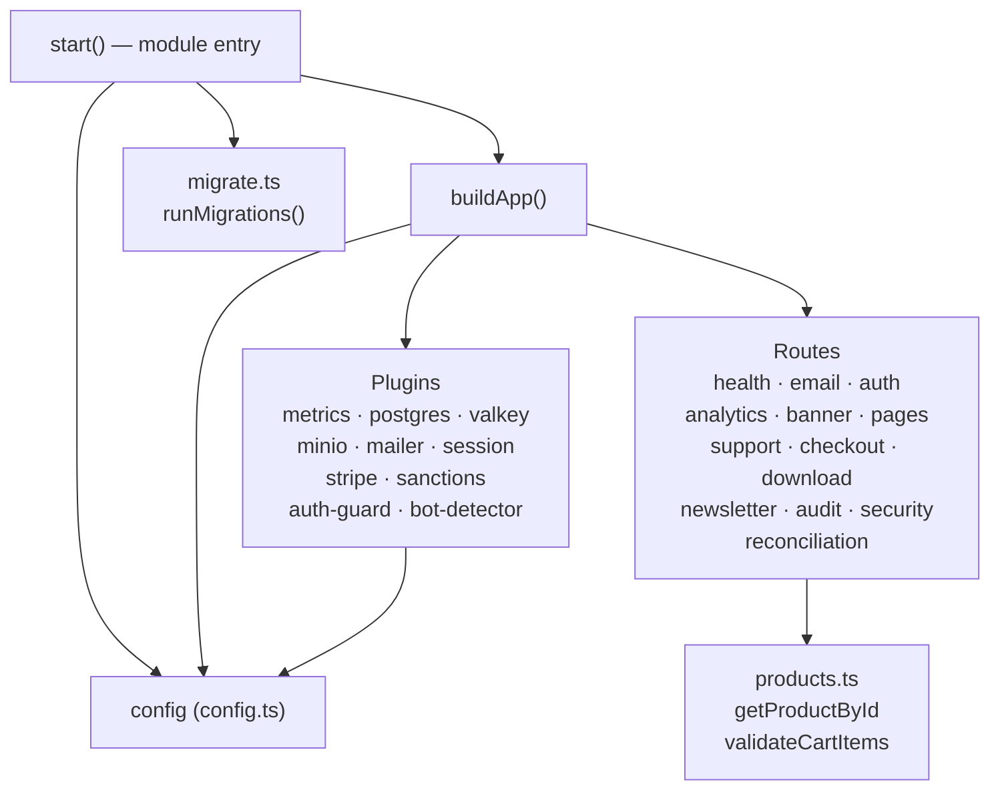

# C4 Code — api/src

## Overview

- **Name**: API Source Root
- **Location**: `api/src/`
- **Primary Language**: TypeScript
- **Purpose**: Entry point and shared foundation for the Fastify 5 API server. This layer wires together the Fastify application instance, all infrastructure plugins (database, cache, object storage, email, session, payments, security), all HTTP route handlers, and database migration execution. It also defines the centralized runtime configuration object and the in-memory product catalog used across route handlers.

---

## Code Elements

### `api/src/index.ts`

#### `buildApp(): FastifyInstance`

- **Signature**: `export function buildApp(): FastifyInstance`
- **Location**: `api/src/index.ts:29`
- **Description**: Constructs and returns a fully configured Fastify application instance. Creates the Fastify server with structured JSON logging (level varies by `NODE_ENV`), proxy trust depth of 1 (for Caddy reverse proxy), and request ID generation that prefers the incoming `x-request-id` header or falls back to `crypto.randomUUID()`. Registers all infrastructure plugins in order (metrics, postgres, valkey, minio, mailer, session, stripe, sanctions, auth-guard, bot-detector), then registers all route modules. Does not start listening — purely assembles the app graph.
- **Key dependencies**:
  - `fastify` (npm) — HTTP framework
  - `node:crypto` — UUID generation for request IDs
  - `./config.js` — reads `config.nodeEnv` for log level
  - All plugins under `./plugins/` (metrics, postgres, valkey, minio, mailer, session, stripe, sanctions, auth-guard, bot-detector)
  - All route modules under `./routes/` (health, email, auth, analytics, banner, pages, support, checkout, download, newsletter, audit, security, reconciliation)

#### `start(): Promise<void>`

- **Signature**: `async function start(): Promise<void>`
- **Location**: `api/src/index.ts:87`
- **Description**: Private async bootstrap function (not exported). Calls `buildApp()`, conditionally runs database migrations when `NODE_ENV === 'development'`, then calls `app.listen()` binding to the host and port from config. On any error, logs to the Fastify logger and exits the process with code 1. Called immediately at module load (bottom of file, line 105).
- **Key dependencies**:
  - `./config.js` — `config.nodeEnv`, `config.api.host`, `config.api.port`
  - `./migrate.js` — `runMigrations()` (only called in development)

---

### `api/src/config.ts`

#### `config` (exported const)

- **Signature**: `export const config: { api, postgres, valkey, minio, smtp, google, session, stripe, baseUrl, nodeEnv } as const`
- **Location**: `api/src/config.ts:13`
- **Description**: A single frozen (`as const`) configuration object assembled from environment variables with development-safe defaults. Exported as a named const and imported by virtually every other module in the API. Organized into seven namespaced sub-objects plus two top-level fields:

  | Sub-key | Env vars read | Purpose |
  |---|---|---|
  | `api` | `API_HOST`, `API_PORT` | Fastify bind address/port |
  | `postgres` | `POSTGRES_HOST/PORT/DB/USER/PASSWORD`, `DATABASE_POOL_MAX/IDLE_TIMEOUT/CONNECT_TIMEOUT` | pg pool config |
  | `valkey` | `VALKEY_HOST`, `VALKEY_PORT` | Redis-compatible cache address |
  | `minio` | `MINIO_ENDPOINT/PORT/USE_SSL/ROOT_USER/ROOT_PASSWORD/BUCKET_FILES/BUCKET_IMAGES` | S3-compatible object storage |
  | `smtp` | `SMTP_HOST/PORT/SECURE/FROM` | Transactional email (Mailpit in dev) |
  | `google` | `GOOGLE_CLIENT_ID/SECRET/CALLBACK_URL` | OAuth2 credentials |
  | `session` | derived `sessionSecret` | Cookie session signing key |
  | `stripe` | `STRIPE_SECRET_KEY/WEBHOOK_SECRET/TAX_ENABLED` | Payment processing |
  | `baseUrl` | `BASE_URL` | Canonical site URL for link generation |
  | `nodeEnv` | `NODE_ENV` | Runtime environment discriminant |

- **Side effects at module load**:
  - Logs a `console.warn` if `NODE_ENV` is unset.
  - Throws an `Error` and prevents startup if `NODE_ENV === 'production'` and `SESSION_SECRET` is not explicitly set in the environment (guards against running in production with the hardcoded dev secret).

- **Key dependencies**: Node.js `process.env` only — no npm imports.

---

### `api/src/products.ts`

#### `ProductInfo` (type)

- **Signature**: `type ProductInfo = { id: string; name: string; price: number }`
- **Location**: `api/src/products.ts:1`
- **Description**: Local (non-exported) TypeScript type describing the shape of a single product record. `price` is stored in the smallest currency unit (cents / pence — e.g., `4900` represents $49.00).

#### `products` (module-private const)

- **Signature**: `const products: ProductInfo[]`
- **Location**: `api/src/products.ts:7`
- **Description**: Hard-coded in-memory catalog of 12 digital products (UI kits, icon packs, fonts, template bundles, etc.). This is the authoritative source of product data for the API — there is no database table for products. All IDs are sequential numeric strings `"1"` through `"12"`.

#### `productMap` (module-private const)

- **Signature**: `const productMap: Map<string, ProductInfo>`
- **Location**: `api/src/products.ts:22`
- **Description**: A `Map` keyed by `ProductInfo.id` string, built once at module load from the `products` array. Provides O(1) product lookups by ID. Not exported; consumed only by the two exported functions below.

#### `getProductById(id: string): ProductInfo | undefined`

- **Signature**: `export function getProductById(id: string): ProductInfo | undefined`
- **Location**: `api/src/products.ts:24`
- **Description**: Looks up a single product by its string ID in `productMap`. Returns the matching `ProductInfo` object, or `undefined` if the ID is not found.
- **Key dependencies**: `productMap` (module-private)

#### `validateCartItems(items): { valid: ProductInfo[]; total: number } | { error: string }`

- **Signature**:
  ```ts
  export function validateCartItems(
    items: { productId: string; quantity: number }[],
  ): { valid: ProductInfo[]; total: number } | { error: string }
  ```
- **Location**: `api/src/products.ts:28`
- **Description**: Validates a list of cart line-items against the in-memory catalog. Iterates `items` and for each entry: looks up the product by `productId` (returns `{ error }` if unknown), checks that `quantity >= 1` (returns `{ error }` if not), accumulates `product.price * quantity` into a running `total`, and collects the resolved `ProductInfo` into `valid[]`. If the final `valid` array is empty (input was `[]`), returns `{ error: 'Cart is empty' }`. On success returns `{ valid, total }` where `total` is the full basket value in cents. Used by the checkout route to validate and price the cart before creating a Stripe Payment Intent.
- **Key dependencies**: `productMap` (module-private)

---

## Dependencies

### Internal

| Imported by | Imports |
|---|---|
| `index.ts` | `./config.js`, `./migrate.js`, all `./plugins/*`, all `./routes/*` |
| `config.ts` | none |
| `products.ts` | none |

Downstream consumers of `products.ts`:
- `api/src/routes/checkout.ts` (confirmed by import pattern — validates cart + prices Stripe intent)

Downstream consumers of `config.ts`:
- `api/src/index.ts` (log level, listen address, migration gate)
- All plugin files (`./plugins/postgres.js`, `./plugins/valkey.js`, `./plugins/minio.js`, `./plugins/mailer.js`, `./plugins/session.js`, `./plugins/stripe.js`) — each reads its own sub-key from `config`

### External (npm packages)

| Package | Used in | Purpose |
|---|---|---|
| `fastify` | `index.ts` | HTTP server framework |
| `node:crypto` | `index.ts` | `randomUUID()` for request ID fallback |

### External (infrastructure services)

| Service | Config key | Default (dev) |
|---|---|---|
| PostgreSQL 16 | `config.postgres` | `localhost:5432` |
| Valkey 8 (Redis) | `config.valkey` | `localhost:6379` |
| MinIO (S3) | `config.minio` | `localhost:9000` |
| SMTP (Mailpit) | `config.smtp` | `localhost:1025` |
| Stripe API | `config.stripe` | n/a (key required) |
| Google OAuth2 | `config.google` | n/a (key required) |

---

## Relationships



---

## Notes

- `products.ts` uses a fully static in-memory catalog — there is no database table for products. Any product additions require a code change and redeployment.
- `config.ts` enforces a hard startup failure in production if `SESSION_SECRET` is missing, but all other secrets (Stripe key, Google OAuth, MinIO password) silently default to empty strings in non-production environments.
- `buildApp` is exported separately from `start()` to support test harnesses that need the Fastify instance without binding a port.
- Migrations are only auto-run in `development`. In production/staging, migrations must be run as a separate step.
