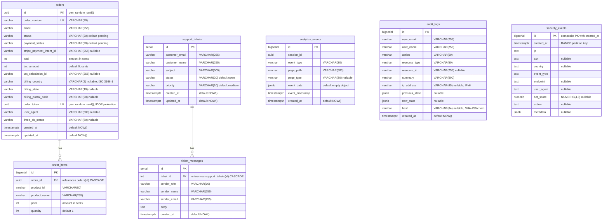

# C4 Component -- Infrastructure

## 1. Overview

| Field | Value |
|---|---|
| **Name** | Infrastructure |
| **Type** | Infrastructure / Platform |
| **Technology** | Docker Compose, PostgreSQL 16, Valkey 8, MinIO, Caddy 2, Mailpit |
| **Location** | `docker/`, `migrations/`, `data/`, `docker-compose.yml` |
| **Source documents** | [c4-code-migrations.md](c4-code-migrations.md), [c4-code-data.md](c4-code-data.md), [c4-code-docker.md](c4-code-docker.md), [c4-code-shared-src.md](c4-code-shared-src.md) |

---

## 2. Purpose

The Infrastructure layer provides the runtime platform for the entire application stack. It owns:

- **Reverse proxy and TLS termination** -- Caddy 2 is the single network entry point, routing traffic to the correct backend service and applying security headers.
- **Relational database** -- PostgreSQL 16 stores orders, analytics events, support tickets, audit logs, and security events across 7 tables managed by 9 sequential migrations.
- **Session and cache store** -- Valkey 8 (Redis-compatible) backs HTTP sessions, per-IP/per-ASN rate limiting, bot detection state, OAuth nonce storage, and a security event write buffer.
- **Object storage** -- MinIO provides S3-compatible storage with a private bucket for digital product file downloads and a public bucket for product images.
- **Development email capture** -- Mailpit intercepts all outbound SMTP in development and exposes a web UI for inspection.
- **File-based configuration** -- flat JSON files in `data/` serve as lightweight runtime stores for admin user lists, banner config, page toggles, newsletter subscribers, IP blocklists, and sanctions data.

No application code runs inside this layer. It provides services consumed by the API, Storefront, and Admin containers.

---

## 3. Infrastructure Components

### 3.1 PostgreSQL 16

| Field | Value |
|---|---|
| **Image** | `postgres:16-alpine` |
| **Internal port** | 5432 |
| **Host port** | `${POSTGRES_PORT}` (default 5432) |
| **Volume** | `postgres_data:/var/lib/postgresql/data` |
| **Healthcheck** | `pg_isready -U $POSTGRES_USER -d $POSTGRES_DB` every 5 s |

**Purpose**: Primary relational store for all transactional, analytical, and compliance data. Managed by `node-pg-migrate` with migrations stored in `migrations/`.

**Extensions**: `pgcrypto` (migration 0001) -- provides `gen_random_uuid()` used for order IDs and order access tokens.

**Tables** (7 total, created across 9 migrations):

| Table | PK Type | Purpose | Created in |
|---|---|---|---|
| `analytics_events` | BIGSERIAL | Storefront page-view and interaction tracking | 0002 |
| `support_tickets` | SERIAL | Customer support ticket headers | 0003 |
| `ticket_messages` | SERIAL | Message thread entries within a ticket | 0003 |
| `orders` | UUID | E-commerce order records (Stripe-backed) | 0004, 0005, 0008 |
| `order_items` | BIGSERIAL | Line items belonging to an order | 0004 |
| `audit_logs` | BIGSERIAL | Immutable admin action audit trail | 0006, 0009 |
| `security_events` | BIGSERIAL (partitioned) | High-volume bot/threat event log | 0007 |

Full column definitions for each table are documented in section 4 (Database Schema) below.

**Partitioning**: `security_events` is RANGE-partitioned by `created_at` with monthly partitions. Three initial partitions cover March--May 2026. New partitions must be created before each month begins.

**Compliance protections**:
- `audit_logs` has a `BEFORE DELETE` trigger (`audit_logs_no_delete`) that raises an exception, making the table append-only at the database level.
- Down migrations for 0006 and 0009 are intentional no-ops to prevent accidental deletion of audit data.
- `audit_logs.hash` implements a SHA-256 hash chain for tamper detection.

**Backup**: `docker/backup.sh` runs `pg_dump` with `--clean --if-exists --no-owner --no-privileges`, pipes through gzip, and stores in `backups/`. Retention policy: 30 days. Intended for daily cron at 03:00.

---

### 3.2 Valkey 8 (Redis-compatible)

| Field | Value |
|---|---|
| **Image** | `valkey/valkey:8-alpine` |
| **Internal port** | 6379 |
| **Host port** | `${VALKEY_PORT}` (default 6379) |
| **Volume** | `valkey_data:/data` |
| **Healthcheck** | `valkey-cli ping` every 5 s |
| **Client library** | `ioredis` (via `api/src/plugins/valkey.ts`) |

**Purpose**: In-memory key-value store serving four categories of workload.

#### 3.2.1 Session Storage

Sessions are managed by `connect-redis` (`RedisStore`) backed by the Valkey client. The session plugin (`api/src/plugins/session.ts`) depends on the `valkey` plugin being registered first.

#### 3.2.2 Rate Limiting

Rate limit counters use atomic `INCR`/`EXPIRE` patterns. Each counter key encodes the scope (IP, endpoint) and has a fixed TTL window.

| Key pattern | Purpose | TTL |
|---|---|---|
| `rl:checkout:{ip}` | Checkout rate limit per IP | Configurable window |
| `rl:analytics:{ip}` | Analytics event ingestion rate limit per IP | Configurable window |
| `rl:newsletter:{ip}` | Newsletter subscription rate limit per IP | Configurable window |
| `admin:oauth:rl:{ip}` | Admin OAuth login attempt rate limit per IP | Configurable window |

#### 3.2.3 Security Event Buffer

Security events are accumulated in a Valkey list and flushed to PostgreSQL's `security_events` table every 5 seconds by the bot-detector plugin. This avoids per-request INSERT latency on a high-volume write path.

| Key | Type | Purpose |
|---|---|---|
| `sec:events:buffer` | LIST | Pending security events awaiting flush to PostgreSQL |
| `sec:events:buffer:flushing` | LIST | Temporary key during atomic RENAME-and-drain flush cycle |
| `sec:counter:429` | STRING | Rolling count of 429 (rate-limited) responses in last 60 s |
| `sec:counter:req` | STRING | Rolling total request count in last 60 s |
| `sec:seen_ips` | SET | Unique IPs seen in the current 60 s window |
| `sec:attacks:active` | STRING | Current attack severity level (expires in 300 s) |
| `sec:attack:start` | STRING | Unix timestamp of attack onset (expires in 86400 s) |

#### 3.2.4 Bot Detection State

| Key pattern | Type | TTL | Purpose |
|---|---|---|---|
| `sec:honeypot:{ip}` | STRING | 86400 s (24 h) | Flags IP that hit a honeypot path |
| `sec:bot:score:{ip}` | STRING | 300 s (5 min) | Cached bot score for IP |
| `sec:checkout_fast:{ip}` | STRING | 86400 s (24 h) | Flags IP with suspiciously fast checkout |
| `rdns:{ip}` | STRING | 60--300 s | Cached reverse-DNS verification result for good-bot UA claims |
| `bot:rl:{ip}` | SORTED SET | sliding | Inter-arrival time samples for uniformity detection |
| `sec:ip:{ip}` | STRING | 60 s | Per-IP request counter for rate spike detection |
| `sec:asn:{asn}` | STRING | 60 s | Per-ASN request counter for ASN-level anomaly detection |

#### 3.2.5 OAuth Nonce Storage

| Key pattern | Type | TTL | Purpose |
|---|---|---|---|
| `oauth:nonce:{nonce}` | STRING | Configurable (`NONCE_TTL`) | Stores role (`admin` or `customer`) associated with OAuth state nonce |

#### 3.2.6 Auth Guard Brute-Force Protection

| Key pattern | Type | TTL | Purpose |
|---|---|---|---|
| `auth:fail:{ip}` | STRING | `COOLDOWN_SECONDS` | Count of failed auth attempts from IP |
| `auth:cooldown:{ip}` | STRING | `COOLDOWN_SECONDS * 2` | Lockout flag set after threshold exceeded |

---

### 3.3 MinIO (S3-compatible Object Storage)

| Field | Value |
|---|---|
| **Image** | `minio/minio:latest` |
| **Internal ports** | 9000 (API), 9001 (Console) |
| **Host port** | `${MINIO_PORT}` (default 9000) -- API only; console is not exposed to host |
| **Volume** | `minio_data:/data` |
| **Healthcheck** | `mc ready local` every 5 s |
| **Init sidecar** | `minio/mc:latest` (one-shot, runs `docker/minio-init.sh`) |

**Buckets**:

| Bucket | Env variable | Access policy | Purpose |
|---|---|---|---|
| `product-files` | `$MINIO_BUCKET_FILES` | **Private** (authenticated API access only) | Digital product download files. API generates presigned URLs with expiry for authorized downloads. |
| `product-images` | `$MINIO_BUCKET_IMAGES` | **Public read** (anonymous download) | Product images served to the storefront via Caddy's `/images/*` proxy. |

**Initialization**: The `minio-init` service (image: `minio/mc:latest`) waits for MinIO to be healthy, then runs `docker/minio-init.sh` which:
1. Configures a `mc` alias pointing at `http://minio:9000` with root credentials
2. Creates both buckets with `--ignore-existing` (idempotent)
3. Sets `download` (anonymous read) policy on the images bucket

**Integration with Caddy**: Public image requests arrive at `GET /images/{filename}`, are rewritten to `/product-images/{filename}`, and proxied to `minio:9000` with the `Host` header set to `minio:9000` for correct virtual-host routing.

**Integration with API**: The API uses the MinIO SDK to generate presigned download URLs for `product-files` bucket objects and to upload/manage files in both buckets.

---

### 3.4 Caddy 2 (Reverse Proxy)

| Field | Value |
|---|---|
| **Image** | `caddy:2-alpine` |
| **Host ports** | `${CADDY_PORT}` (default 80), `${CADDY_HTTPS_PORT}` (default 443) |
| **Volumes** | `./docker/Caddyfile:/etc/caddy/Caddyfile:ro`, `caddy_data:/data`, `caddy_config:/config` |
| **Config file** | `docker/Caddyfile` |

**TLS behaviour**:
- Development (`CADDY_HOSTNAME` unset): listens on `:80`, HTTP only.
- Production (`CADDY_HOSTNAME` set to a domain): Caddy auto-obtains Let's Encrypt TLS certificates and redirects HTTP to HTTPS.

**Logging**: JSON-formatted access logs to stdout at INFO level, captured by Docker for log aggregation.

#### 3.4.1 Security Headers

Applied globally to every proxied response:

| Header | Value | Purpose |
|---|---|---|
| `X-Content-Type-Options` | `nosniff` | Prevents MIME-type sniffing |
| `X-Frame-Options` | `SAMEORIGIN` | Prevents clickjacking via iframes |
| `Referrer-Policy` | `strict-origin-when-cross-origin` | Limits referrer leakage on cross-origin navigation |
| `X-XSS-Protection` | `0` | Disables legacy XSS filter (modern CSP preferred) |
| `Permissions-Policy` | `geolocation=(), microphone=(), camera=()` | Denies browser access to device APIs |
| `Strict-Transport-Security` | `max-age=31536000; includeSubDomains` | HSTS: enforces HTTPS for 1 year (no-op on HTTP) |
| `-Server` | (removed) | Strips Caddy version fingerprint |

Caddy also adds `X-Forwarded-For` and `X-Forwarded-Proto` automatically on proxied requests. The Fastify API reads these with `trustProxy: 1`.

#### 3.4.2 Routing Rules

Routes are listed in Caddy match order. Caddy evaluates the most specific path matcher first within `handle` blocks.

| # | Path matcher | Target | Purpose |
|---|---|---|---|
| 1 | `/wp-login.php`, `/.env`, `/phpMyAdmin*`, `/admin.php`, `/xmlrpc.php`, `/wp-admin*`, `/setup.php` | `api:3001` | **Honeypot**: common exploit-scanner targets are forwarded to the API's bot-detector plugin for logging. The API returns a response without revealing these paths are traps. |
| 2 | `/admin` (exact, no trailing slash) | `301 -> /admin/` | **Admin SPA redirect**: ensures trailing slash so Vite's relative asset paths resolve correctly. |
| 3 | `/api/*` | `api:3001` | **API**: all REST API and webhook requests. |
| 4 | `/images/*` | `minio:9000` (rewritten to `/product-images/*`) | **Image proxy**: strips `/images` prefix, rewrites to `/product-images{uri}`, sets `Host: minio:9000`. |
| 5 | `/docs*` | `docs:3003` | **Documentation site**: Next.js docs application. |
| 6 | `/admin/*` | `${ADMIN_BACKEND}` (default: `admin:3002`) | **Admin SPA**: Vite dev server (dev) or static file server (prod). |
| 7 | `/_next/webpack-hmr` | `storefront:3000` | **HMR WebSocket**: Next.js Hot Module Replacement for development. |
| 8 | `*` (catch-all) | `storefront:3000` | **Storefront**: all remaining requests go to the Next.js storefront. |

---

### 3.5 Mailpit (Development Email)

| Field | Value |
|---|---|
| **Image** | `axllent/mailpit:latest` |
| **Internal ports** | 1025 (SMTP), 8025 (Web UI) |
| **Host ports** | `${MAILPIT_SMTP_PORT}` (default 1025), `${MAILPIT_UI_PORT}` (default 8025) |
| **Healthcheck** | `wget --spider http://localhost:8025/` every 5 s |

**Purpose**: Captures all outbound email from the API in development. The API's mailer plugin sends SMTP to `mailpit:1025`. All captured messages are viewable at `http://localhost:8025`.

**Production note**: In production, `SMTP_HOST` and `SMTP_PORT` would be changed to point at a real mail relay (e.g. SES, Postmark). Mailpit is a development-only service.

---

## 4. Database Schema

### 4.1 Entity-Relationship Diagram



### 4.2 Index Summary

| Table | Index columns | Type |
|---|---|---|
| `analytics_events` | `(event_type, event_timestamp)` | Composite |
| `analytics_events` | `session_id` | Single |
| `analytics_events` | `page_type` | Single |
| `support_tickets` | `customer_email` | Single |
| `support_tickets` | `status` | Single |
| `ticket_messages` | `ticket_id` | Single |
| `orders` | `email` | Single |
| `orders` | `status` | Single |
| `orders` | `stripe_payment_intent_id` | Single |
| `orders` | `created_at` | Single |
| `orders` | `order_token` | Unique |
| `audit_logs` | `created_at` | Single |
| `audit_logs` | `(user_email, created_at)` | Composite |
| `audit_logs` | `(resource_type, resource_id)` | Composite |
| `security_events` | `created_at` | Single (inherited by partitions) |
| `security_events` | `ip` | Single (inherited by partitions) |
| `security_events` | `event_type` | Single (inherited by partitions) |

### 4.3 Triggers and Functions

| Object | Type | Table | Behaviour |
|---|---|---|---|
| `prevent_audit_log_delete()` | PL/pgSQL function | -- | Raises an exception unconditionally |
| `audit_logs_no_delete` | BEFORE DELETE trigger | `audit_logs` | Calls `prevent_audit_log_delete()`, making the table append-only |

---

## 5. Data Files

All files reside in the `data/` directory and are bind-mounted into the API container at runtime.

| File | Mutable at runtime | Admin-writable via API | Schema | Purpose |
|---|---|---|---|---|
| `admins.json` | No (requires restart) | No | `Array<{ email: string, tier: "super_admin" \| "admin" }>` | Authorized admin user registry and privilege tiers |
| `banner.json` | Yes | Yes (`POST /api/banner`) | `{ active, text, imageUrl, linkUrl, linkLabel, updatedAt }` | Storefront announcement banner configuration |
| `pages.json` | Yes | Yes (`POST /api/pages`) | `{ pages: { [slug]: { underConstruction: boolean } }, updatedAt }` | Per-page live/under-construction toggle |
| `newsletter.json` | Yes | Partial (admin reads, storefront writes) | `{ enabled, subscribers: [], updatedAt }` | Newsletter subscriber list and feature flag |
| `banned-ips.json` | Yes | Yes (security dashboard) | `Array<string>` (IPv4/IPv6 addresses) | Runtime IP blocklist checked by bot-detector plugin |
| `sanctions-blocklist.json` | No (requires deploy) | No | `Array<any>` (entity records) | OFAC / sanctions screening data consumed by `sanctions.ts` plugin |

**Mount modes in docker-compose.yml**:
- `admins.json` is mounted `:ro` (read-only) -- the API cannot modify it.
- All other data files are mounted read-write.

---

## 6. Docker Compose Services

### 6.1 Infrastructure Services

| Service | Image | Ports (host:container) | Volume | Purpose |
|---|---|---|---|---|
| `postgres` | `postgres:16-alpine` | `${POSTGRES_PORT}:5432` | `postgres_data` | Relational database |
| `valkey` | `valkey/valkey:8-alpine` | `${VALKEY_PORT}:6379` | `valkey_data` | Session/cache/rate-limit store |
| `minio` | `minio/minio:latest` | `${MINIO_PORT}:9000` | `minio_data` | S3-compatible object storage |
| `minio-init` | `minio/mc:latest` | none | bind: `docker/minio-init.sh` | One-shot bucket creation and policy setup |
| `caddy` | `caddy:2-alpine` | `${CADDY_PORT}:80`, `${CADDY_HTTPS_PORT}:443` | `caddy_data`, `caddy_config`, bind: `Caddyfile` | Reverse proxy and TLS termination |
| `mailpit` | `axllent/mailpit:latest` | `${MAILPIT_SMTP_PORT}:1025`, `${MAILPIT_UI_PORT}:8025` | none | Development email capture |

### 6.2 Application Services

| Service | Image | Ports (host:container) | Purpose |
|---|---|---|---|
| `api` | Built from `api/Dockerfile` | `${API_PORT}:3001` | Fastify REST API |
| `storefront` | Built from `storefront/Dockerfile` | `${STOREFRONT_PORT}:3000` | Next.js customer-facing storefront |
| `admin` | Built from `admin/Dockerfile` | `${ADMIN_PORT}:3002` | Vite + React admin dashboard |
| `docs` | Built from `docs/Dockerfile` | `${DOCS_PORT}:3003` | Next.js documentation site |

### 6.3 Service Dependency Graph

Startup order is enforced by `depends_on` with health/start conditions:

```
postgres (healthy) ──┐
valkey   (healthy) ──┤
minio    (healthy) ──┼──> api (healthy) ──┬──> storefront (started) ──┐
mailpit  (healthy) ──┘                    │                           │
                                          ├──> admin (started) ───────┤
                                          │                           ├──> caddy
minio (healthy) ──> minio-init            └──> docs (started) ────────┘
```

### 6.4 Named Volumes

| Volume | Used by | Purpose |
|---|---|---|
| `postgres_data` | `postgres` | Persistent database storage |
| `valkey_data` | `valkey` | Persistent cache/session data |
| `minio_data` | `minio` | Persistent object storage |
| `caddy_data` | `caddy` | TLS certificates and ACME state |
| `caddy_config` | `caddy` | Caddy runtime configuration |

### 6.5 Network

All services are connected to a single bridge network: `app-network`. Services reference each other by Docker Compose service name (e.g., `postgres`, `valkey`, `minio:9000`, `api:3001`).

### 6.6 Prometheus Observability

The `api` service carries Prometheus scrape labels:

```yaml
labels:
  prometheus.scrape: "true"
  prometheus.port: "3001"
  prometheus.path: "/api/metrics"
```

These labels allow a Prometheus instance (not included in docker-compose.yml) to auto-discover the API's metrics endpoint.

---

## 7. Component Diagram

```
C4Component
  title Infrastructure -- Component Diagram

  Container_Boundary(infra, "Infrastructure Layer") {

    Component(caddy, "Caddy 2", "Reverse Proxy", "TLS termination, security headers, route dispatch, honeypot paths")
    Component(pg, "PostgreSQL 16", "Relational Database", "7 tables: orders, order_items, analytics_events, support_tickets, ticket_messages, audit_logs, security_events")
    Component(valkey, "Valkey 8", "In-Memory Store", "Sessions, rate limiting, bot detection state, security event buffer, OAuth nonces")
    Component(minio, "MinIO", "Object Storage", "S3-compatible: product-files (private), product-images (public)")
    Component(mailpit, "Mailpit", "Dev Email", "SMTP capture on port 1025, web UI on port 8025")
    Component(datafiles, "Data Files", "JSON Config", "admins, banner, pages, newsletter, banned-ips, sanctions-blocklist")
    Component(migrations, "Migrations", "node-pg-migrate", "9 sequential JS migrations managing schema evolution")
    Component(backup, "Backup Script", "Shell / pg_dump", "Daily compressed backups with 30-day retention")
    Component(minioinit, "MinIO Init", "Shell / mc", "One-shot bucket creation and access policy setup")

  }

  Container_Boundary(app, "Application Layer") {

    Component(api, "API", "Fastify 5", "REST API server")
    Component(storefront, "Storefront", "Next.js 15", "Customer-facing SSR storefront")
    Component(admin, "Admin", "Vite + React 19", "Admin dashboard SPA")
    Component(docs, "Docs", "Next.js", "Documentation site")

  }

  Boundary(ext, "External") {
    Component(browser, "Browser", "", "End user")
    Component(letsencrypt, "Let's Encrypt", "", "TLS certificate authority")
  }

  Rel(browser, caddy, "HTTPS / HTTP", "ports 80, 443")
  Rel(caddy, api, "reverse_proxy", "/api/*, honeypot paths")
  Rel(caddy, storefront, "reverse_proxy", "catch-all, /_next/webpack-hmr")
  Rel(caddy, admin, "reverse_proxy", "/admin/*")
  Rel(caddy, docs, "reverse_proxy", "/docs*")
  Rel(caddy, minio, "reverse_proxy", "/images/* -> /product-images/*")
  Rel(caddy, letsencrypt, "ACME", "auto TLS in production")

  Rel(api, pg, "SQL", "tcp/5432")
  Rel(api, valkey, "Redis protocol", "tcp/6379")
  Rel(api, minio, "S3 API", "tcp/9000")
  Rel(api, mailpit, "SMTP", "tcp/1025")
  Rel(api, datafiles, "fs read/write", "bind mount")

  Rel(migrations, pg, "DDL", "schema creation")
  Rel(minioinit, minio, "mc CLI", "bucket setup")
  Rel(backup, pg, "pg_dump", "compressed SQL export")
```

### Component Interaction Summary (text)

```
                        +------------------+
                        |     Browser      |
                        +--------+---------+
                                 |
                          HTTP / HTTPS
                                 |
                        +--------v---------+
                        |     Caddy 2      |    <--- Let's Encrypt (prod)
                        | (reverse proxy)  |
                        +--+--+--+--+--+---+
                           |  |  |  |  |
          +----------------+  |  |  |  +-------------------+
          |                   |  |  |                      |
    /api/* & honeypot    catch-all |  /admin/*         /images/*
          |               |       |     |                  |
    +-----v-----+  +------v----+ | +---v------+   +-------v-------+
    |  API       |  | Storefront| | |  Admin   |   |    MinIO      |
    | (Fastify)  |  | (Next.js) | | | (Vite)   |   | product-images|
    +--+--+--+---+  +-----------+ | +----------+   | product-files |
       |  |  |                    |                 +---------------+
       |  |  |              +-----v----+
       |  |  |              |   Docs   |
       |  |  |              | (Next.js)|
       |  |  |              +----------+
       |  |  |
       |  |  +-------> Mailpit (SMTP :1025)
       |  |
       |  +----------> Valkey 8 (:6379)
       |                sessions, rate limits,
       |                bot state, event buffer
       |
       +--------------> PostgreSQL 16 (:5432)
                         orders, analytics,
                         support, audit, security

    data/*.json  <--- bind-mounted into API container
    migrations/  ---> run against PostgreSQL via node-pg-migrate
    backup.sh    ---> pg_dump from PostgreSQL container
    minio-init   ---> mc CLI against MinIO on first startup
```

---

## Appendix A: Environment Variables (Infrastructure)

Extracted from `.env.example`. These control the infrastructure services.

| Variable | Default | Service | Purpose |
|---|---|---|---|
| `POSTGRES_HOST` | `postgres` | PostgreSQL | Hostname (Docker service name) |
| `POSTGRES_PORT` | `5432` | PostgreSQL | Host-mapped port |
| `POSTGRES_DB` | `shopify_stack` | PostgreSQL | Database name |
| `POSTGRES_USER` | `postgres` | PostgreSQL | Database user |
| `POSTGRES_PASSWORD` | (required) | PostgreSQL | Database password |
| `DATABASE_POOL_MAX` | `20` | API -> PostgreSQL | Connection pool max size |
| `DATABASE_POOL_IDLE_TIMEOUT` | `30000` | API -> PostgreSQL | Idle connection timeout (ms) |
| `DATABASE_POOL_CONNECT_TIMEOUT` | `5000` | API -> PostgreSQL | Connection timeout (ms) |
| `VALKEY_HOST` | `valkey` | Valkey | Hostname (Docker service name) |
| `VALKEY_PORT` | `6379` | Valkey | Host-mapped port |
| `MINIO_ENDPOINT` | `minio` | MinIO | Hostname (Docker service name) |
| `MINIO_PORT` | `9000` | MinIO | S3 API port |
| `MINIO_ROOT_USER` | `minioadmin` | MinIO | Admin username |
| `MINIO_ROOT_PASSWORD` | (required) | MinIO | Admin password |
| `MINIO_USE_SSL` | `false` | MinIO | Whether to use TLS for S3 API calls |
| `MINIO_BUCKET_FILES` | `product-files` | MinIO | Private files bucket name |
| `MINIO_BUCKET_IMAGES` | `product-images` | MinIO | Public images bucket name |
| `CADDY_PORT` | `80` | Caddy | HTTP port |
| `CADDY_HTTPS_PORT` | `443` | Caddy | HTTPS port |
| `CADDY_HOSTNAME` | (unset = `:80`) | Caddy | Domain name triggers auto-TLS |
| `MAILPIT_SMTP_PORT` | `1025` | Mailpit | SMTP capture port |
| `MAILPIT_UI_PORT` | `8025` | Mailpit | Web UI port |
| `SMTP_HOST` | `mailpit` | API -> Mailpit | SMTP server hostname |
| `SMTP_PORT` | `1025` | API -> Mailpit | SMTP server port |
| `SMTP_SECURE` | `false` | API -> Mailpit | Use TLS for SMTP |
| `SMTP_FROM` | `PixelCart <noreply@pixelcart.com>` | API -> Mailpit | Email sender address |
