# C4 Component Index -- Shopify Stack Clone

## System Components

| Component | Type | Technology | Location | Description |
|-----------|------|------------|----------|-------------|
| [API Server](c4-component-api-server.md) | Service | Fastify 5 / TypeScript | `api/` | Central backend service orchestrating authentication (Google OAuth), payments (Stripe), token-gated file downloads (MinIO presigned URLs), bot detection, sanctions screening, tamper-evident audit logging, analytics ingestion, support tickets, and Prometheus metrics. Exposes a REST API consumed by both front-end applications and external webhooks. |
| [Customer Storefront](c4-component-storefront.md) | Web App | Next.js 15 (App Router) / React 19 / Tailwind CSS | `storefront/` | Public-facing PixelForge digital product store providing product browsing with category filters and search, localStorage-persisted cart, two-phase Stripe checkout with optional tax calculation, Google OAuth customer login, account management (orders, downloads, support tickets), SEO (JSON-LD, sitemap, robots), consent-gated analytics, and light/dark theme support. |
| [Admin Dashboard](c4-component-admin-dashboard.md) | Web App (SPA) | Vite 6 / React 19 / Tailwind CSS / Recharts | `admin/` | Single-page admin application with 29 routes covering dashboard analytics, product/collection/order/customer/discount management, email campaigns, banner/page configuration, support ticket triage, newsletter subscriber management, audit log viewer, real-time security monitoring with auto-polling, finance/tax reports, and CSV export across multiple views. |
| [Infrastructure](c4-component-infrastructure.md) | Platform | Docker Compose / PostgreSQL 16 / Valkey 8 / MinIO / Caddy 2 / Mailpit | `docker/`, `migrations/`, `data/` | Runtime platform providing reverse proxy with security headers and auto-TLS (Caddy), relational storage with 7 tables across 9 migrations (PostgreSQL), session/cache/rate-limit store (Valkey), S3-compatible object storage with private and public buckets (MinIO), development email capture (Mailpit), and flat-file JSON configuration for admin lists, bans, sanctions, banner, pages, and newsletter data. |
| [Documentation Site](c4-component-docs-site.md) | Web App | Next.js 15 (App Router) / React 19 / Tailwind CSS | `docs/` | Self-contained developer and operator documentation site (StackDocs) with 6 active pages covering getting started, platform overview, API reference, security/payments, and integrations. Fully isolated -- no API calls, no database, no authentication. Authored in inline JSX with custom CSS typography. |

---

## Component Relationships Diagram

```mermaid
C4Component
  title System Component Relationships -- Shopify Stack Clone

  Container_Boundary(platform, "Shopify Stack Clone") {
    Component(storefront, "Customer Storefront", "Next.js 15", "Public product catalog, cart, Stripe checkout, customer accounts, SEO, analytics")
    Component(admin, "Admin Dashboard", "Vite + React 19", "Store management SPA: products, orders, customers, analytics, security, email campaigns")
    Component(api, "API Server", "Fastify 5", "REST API: auth, payments, downloads, bot detection, audit logging, support, metrics")
    Component(docs, "Documentation Site", "Next.js 15", "Developer/operator docs, fully isolated, no runtime dependencies")
    Component(db, "PostgreSQL 16", "Database", "7 tables: orders, order_items, analytics_events, support_tickets, ticket_messages, audit_logs, security_events")
    Component(cache, "Valkey 8", "Cache / Session Store", "Sessions, rate limiting, bot detection state, security event buffer, OAuth nonces")
    Component(storage, "MinIO", "Object Storage", "S3-compatible: product-files (private, presigned URLs), product-images (public)")
    Component(proxy, "Caddy 2", "Reverse Proxy", "TLS termination, security headers, route dispatch, honeypot forwarding")
    Component(mailpit, "Mailpit", "Dev Email", "SMTP capture on :1025, web UI on :8025 (dev only)")
    Component(datafiles, "Data Files", "JSON Config", "admins, banned-ips, sanctions, banner, pages, newsletter")
  }

  System_Ext(google, "Google OAuth 2.0", "Identity provider for admin and customer authentication")
  System_Ext(stripe, "Stripe", "Payment processing: PaymentIntents, Tax Calculations, webhook verification")
  System_Ext(smtp, "SMTP Server", "Production transactional and campaign email delivery")
  System_Ext(maxmind, "MaxMind GeoIP", "Optional IP geolocation and ASN lookup via local .mmdb files")
  System_Ext(tor, "Tor Project", "Bulk exit node list fetched at API startup for bot scoring")
  System_Ext(github, "GitHub API", "Optional commit history in admin audit log")
  System_Ext(letsencrypt, "Let's Encrypt", "Auto-TLS certificates for production")
  System_Ext(stripejs, "Stripe.js", "Client-side payment UI (PaymentElement)")

  Rel(proxy, storefront, "reverse_proxy", "catch-all and /_next/webpack-hmr")
  Rel(proxy, admin, "reverse_proxy", "/admin/*")
  Rel(proxy, api, "reverse_proxy", "/api/* and honeypot paths")
  Rel(proxy, docs, "reverse_proxy", "/docs*")
  Rel(proxy, storage, "reverse_proxy", "/images/* rewritten to /product-images/*")
  Rel(proxy, letsencrypt, "ACME", "auto-TLS in production")

  Rel(storefront, api, "HTTP", "Auth, checkout, analytics, banner, pages, newsletter, support tickets")
  Rel(storefront, stripejs, "HTTPS", "Payment UI rendering and confirmPayment()")
  Rel(admin, api, "HTTP", "Auth, analytics, banner, pages, support, newsletter, audit, security, email")
  Rel(admin, github, "HTTPS", "Optional commit history for audit log")

  Rel(api, db, "SQL", "tcp/5432: orders, analytics, support, audit logs, security events")
  Rel(api, cache, "Redis protocol", "tcp/6379: sessions, rate limits, bot state, event buffer, nonces")
  Rel(api, storage, "S3 API", "tcp/9000: presigned download URLs, file management")
  Rel(api, mailpit, "SMTP", "tcp/1025: dev email capture")
  Rel(api, smtp, "SMTP", "tcp/465 or 587: production email delivery")
  Rel(api, datafiles, "filesystem", "bind-mounted JSON config files")
  Rel(api, google, "HTTPS", "OAuth token exchange and ID token verification")
  Rel(api, stripe, "HTTPS", "PaymentIntents, Tax Calculations, webhook signature verification")
  Rel(api, maxmind, "filesystem", "Optional .mmdb database lookup")
  Rel(api, tor, "HTTPS", "Startup fetch of Tor exit node list")
```



---

## External Systems

| External System | Type | Purpose | Integration |
|----------------|------|---------|-------------|
| Google OAuth 2.0 | Auth Provider | Admin and customer authentication | OAuth 2.0 redirect flow with nonce-based CSRF protection; token exchange and ID token verification via `google-auth-library` |
| Stripe | Payment Processor | Checkout, automatic tax calculation, webhook processing, payment reconciliation | REST API via Stripe SDK (`PaymentIntents`, `Tax Calculations`); webhook signature verification; client-side `PaymentElement` via `@stripe/react-stripe-js` |
| SMTP Server | Email Provider | Transactional order confirmation and bulk campaign email delivery | SMTP via `nodemailer`; Mailpit in development (`:1025`), production relay (`:465`/`:587`) in production |
| MaxMind GeoIP | Data Service | Optional IP geolocation and ASN classification for bot scoring | Local `.mmdb` file lookup via `maxmind` npm package; graceful degradation if files not present |
| Tor Project | Security Data | Exit node identification for bot detection scoring | HTTP bulk list download at API startup; loaded into in-memory Set for O(1) lookup |
| GitHub API | Code Platform | Optional recent commit history displayed alongside audit log entries | REST API (`api.github.com/repos/:repo/commits`) when `VITE_GITHUB_REPO` env var is configured |
| Let's Encrypt | Certificate Authority | Automatic TLS certificate provisioning for production deployments | ACME protocol via Caddy's built-in auto-TLS when `CADDY_HOSTNAME` is set to a domain |
| Stripe.js | Payment UI | Client-side secure payment form rendering | Loaded via `@stripe/stripe-js` in the Storefront; renders `PaymentElement` and handles `confirmPayment()` |

---

## Cross-Component Data Flow Summary

### Authentication Flow

```
Browser --> Caddy --> Storefront or Admin
  |                        |
  | (click login)          |
  |                        v
  +--- redirect --------> API (/api/auth/google or /api/auth/customer/google)
                            |
                            v
                      Google OAuth 2.0 (consent screen)
                            |
                            v
                      API (/api/auth/google/callback)
                            |
                       +----|----+
                       |         |
                   Valkey      Session
                 (nonce)     (cookie set)
                       |
                       v
                Browser redirected to Storefront (/) or Admin (/admin)
```

### Purchase Flow

```
Storefront (cart)
  |
  | POST /api/checkout/create-payment-intent
  v
API Server
  |--- validates cart against in-memory product catalog
  |--- screens buyer email against sanctions blocklist
  |--- creates order + order_items in PostgreSQL
  |--- creates Stripe PaymentIntent
  v
Storefront (Stripe PaymentElement)
  |
  | stripe.confirmPayment()
  v
Stripe (processes payment)
  |
  | POST /api/checkout/webhook (payment_intent.succeeded)
  v
API Server
  |--- marks order as paid in PostgreSQL
  |--- bot-detector checks for fast-checkout anomaly
  |--- sends HTML confirmation email via SMTP
  v
Storefront (polls GET /api/checkout/order/:id)
  |
  | displays download links (presigned MinIO URLs)
```

### Security Event Pipeline

```
Browser request
  |
  v
Caddy (security headers, forwarded headers)
  |
  v
API Server
  |
  +--- auth-guard (IP ban check, rate limiting)
  |       |--- banned? --> 403
  |       |--- failed auth? --> Valkey counter --> progressive ban
  |
  +--- bot-detector (multi-signal scoring)
  |       |--- UA classification, missing headers, honeypot hits
  |       |--- rDNS spoofing, Tor exit nodes, datacenter ASN
  |       |--- inter-arrival time analysis, fast-checkout detection
  |       |--- score >= 0.85? --> auto IP ban
  |       |--- events buffered in Valkey list
  |
  +--- bot-detector flush (every 5s)
          |--- RENAME + LRANGE from Valkey buffer
          |--- bulk INSERT into PostgreSQL security_events (partitioned)
```

---

## Code-Level Documentation Index

Each component document above links to detailed code-level (C4 Level 4) documents. The full inventory is:

### API Server

| Document | Scope |
|----------|-------|
| [c4-code-api-src.md](c4-code-api-src.md) | Entry point, configuration, product catalog |
| [c4-code-api-src-lib.md](c4-code-api-src-lib.md) | Audit log writer with SHA-256 hash chain |
| [c4-code-api-src-plugins.md](c4-code-api-src-plugins.md) | 10 Fastify plugins (postgres, valkey, minio, session, auth-guard, bot-detector, sanctions, stripe, mailer, metrics) |
| [c4-code-api-src-routes.md](c4-code-api-src-routes.md) | 13 route modules (auth, checkout, download, analytics, security, audit, support, email, newsletter, banner, pages, reconciliation, health) |

### Customer Storefront

| Document | Scope |
|----------|-------|
| [c4-code-storefront-src-app.md](c4-code-storefront-src-app.md) | App Router pages, layouts, SEO files |
| [c4-code-storefront-src-components.md](c4-code-storefront-src-components.md) | UI components (layout, product, cart, checkout, analytics, newsletter, promo, seo, ui primitives) |
| [c4-code-storefront-src-lib.md](c4-code-storefront-src-lib.md) | Contexts, API client, Stripe init, consent, geo data, mock data, utilities |

### Admin Dashboard

| Document | Scope |
|----------|-------|
| [c4-code-admin-src-core.md](c4-code-admin-src-core.md) | Entry point, router, contexts, library modules, 26 page components |
| [c4-code-admin-src-components.md](c4-code-admin-src-components.md) | Reusable UI components (design system, layout, auth, analytics, orders, products, dashboard, shared) |

### Infrastructure

| Document | Scope |
|----------|-------|
| [c4-code-docker.md](c4-code-docker.md) | Docker Compose, Dockerfiles, Caddyfile, backup script |
| [c4-code-migrations.md](c4-code-migrations.md) | 9 sequential database migrations |
| [c4-code-data.md](c4-code-data.md) | Flat-file JSON configuration files |
| [c4-code-shared-src.md](c4-code-shared-src.md) | Shared workspace (placeholder) |

### Documentation Site

| Document | Scope |
|----------|-------|
| [c4-code-docs-src.md](c4-code-docs-src.md) | All components, styles, configuration for docs/ |

---

## Related Documentation

| Document | Level | Status |
|----------|-------|--------|
| [c4-context.md](c4-context.md) | C4 Context (Level 1) | Complete |
| [c4-container.md](c4-container.md) | C4 Container (Level 2) | Complete |
| **c4-component.md** (this file) | C4 Component (Level 3) | Complete |
| Code-level documents (listed above) | C4 Code (Level 4) | Complete |
