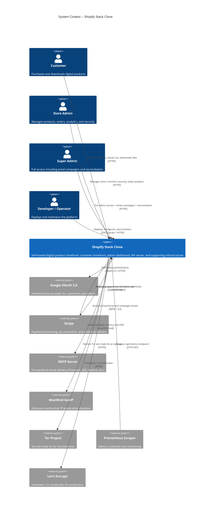

# C4 Context -- Shopify Stack Clone

## 1. System Overview

**One-sentence description**: A self-hosted digital product storefront platform that lets creators sell templates, UI kits, fonts, icons, and other digital downloads with full ownership of their technology stack.

The Shopify Stack Clone (branded **PixelForge** by default) is a turnkey platform for selling digital products online. It provides everything needed to run a complete digital storefront: a customer-facing website for browsing and purchasing products, an administrative dashboard for managing the business, Stripe-powered checkout with automatic tax calculation, secure token-gated file delivery through S3-compatible storage, Google OAuth authentication for both customers and administrators, transactional email, and a built-in documentation site for operators. The platform ships as a Docker Compose stack that can be deployed on a single server with a single command.

The platform is designed around security and compliance from the ground up. It includes a multi-signal bot detection system that automatically identifies and bans malicious traffic, a tamper-evident audit log with SHA-256 hash chain integrity, OFAC sanctions screening at checkout, progressive authentication throttling, and a real-time security monitoring dashboard. All of these capabilities are built in rather than bolted on, giving operators enterprise-grade security without third-party security service subscriptions.

Unlike hosted alternatives such as Gumroad, Lemon Squeezy, or Shopify itself, this platform charges no platform fees, no per-transaction percentage, and no monthly subscription. The operator pays only for their own hosting and Stripe's standard payment processing fees. The entire codebase is open source (MIT), self-hosted, and fully modifiable. This makes it ideal for independent developers, indie makers, small design studios, and solo creators who want complete control over their storefront, customer data, and revenue.

---

## 2. Personas

### Human Users

#### Customer

| Field | Value |
|-------|-------|
| **Type** | Human User |
| **Description** | An end user who visits the storefront to discover, purchase, and download digital products such as UI kits, icon packs, fonts, templates, and design assets. Customers may browse anonymously but must authenticate (via Google OAuth) to complete purchases and access their account. |
| **Goals** | Discover products through browsing, collections, and search. Purchase products securely with credit card via Stripe. Access downloads immediately after payment. View order history and re-download past purchases. Submit and track support tickets. |
| **Key features** | Product Discovery, Shopping Cart, Stripe Checkout, Customer Authentication, Digital Product Downloads, Account Management, Support Tickets |

#### Store Administrator

| Field | Value |
|-------|-------|
| **Type** | Human User |
| **Description** | A trusted team member who manages the day-to-day operations of the store. Administrators are identified by their Google account email address, which must be listed in the `data/admins.json` allowlist. Admin privileges are tiered: `viewer` (read-only), `editor` (content management), `admin` (security and compliance), and `super_admin` (full access including email campaigns). |
| **Goals** | Add and update product listings. Monitor orders and revenue. Respond to customer support tickets. Review analytics and user behaviour insights. Monitor the security dashboard for threats. Export data for reporting. |
| **Key features** | Admin Product and Order Management, Analytics and Reporting, Support Tickets, Security Dashboard and Bot Protection, Audit Logging |

#### Super Administrator

| Field | Value |
|-------|-------|
| **Type** | Human User |
| **Description** | The highest-privilege administrator tier (`super_admin`). In addition to all standard admin capabilities, super administrators can send bulk email campaigns and access full financial reconciliation against Stripe records. Typically the store owner or technical lead. |
| **Goals** | Send email campaigns to newsletter subscribers. Reconcile internal order records against Stripe payment data. Perform all admin functions. |
| **Key features** | All admin features plus Newsletter Management, Transactional Email campaigns, Financial Reconciliation |

#### Developer / Operator

| Field | Value |
|-------|-------|
| **Type** | Human User |
| **Description** | The technical person responsible for deploying, configuring, and maintaining the platform infrastructure. Interacts with the system through Docker, environment configuration, database migrations, DNS setup, and monitoring endpoints. May also be the store owner in solo operations. |
| **Goals** | Deploy the platform from source using Docker Compose. Configure credentials (Stripe, Google OAuth, session secrets, database passwords). Run database migrations. Set up production TLS via Caddy. Monitor system health and Prometheus metrics. Manage backups. |
| **Key features** | API Health and Metrics, Documentation Site |

### Programmatic Users / External Systems

#### Stripe

| Field | Value |
|-------|-------|
| **Type** | External System (Programmatic) |
| **Description** | Stripe's webhook infrastructure sends HTTP POST requests to the API Server to confirm payment outcomes. After a customer completes a payment, Stripe delivers a `payment_intent.succeeded` event to `POST /api/checkout/webhook`. The API Server verifies the webhook signature using `STRIPE_WEBHOOK_SECRET` before processing. |
| **Goals** | Deliver payment confirmation events reliably. Ensure the store records successful payments and activates download access. |
| **Key features** | Stripe Checkout with Tax Support (webhook leg) |

#### Google OAuth

| Field | Value |
|-------|-------|
| **Type** | External System (Programmatic) |
| **Description** | Google's OAuth 2.0 authorization server authenticates both customers and administrators. The API Server initiates the OAuth redirect flow, Google presents its consent screen, and upon approval returns an authorization code that the API Server exchanges for identity tokens. |
| **Goals** | Verify user identity. Provide email address for session creation and admin tier lookup. |
| **Key features** | Customer Authentication |

#### Prometheus Scraper

| Field | Value |
|-------|-------|
| **Type** | External System (Programmatic) |
| **Description** | A Prometheus server (or compatible scraper) that periodically fetches metrics from the API Server's `GET /api/metrics` endpoint. Metrics include HTTP request histograms, security counters (auth failures, rate limits, IP bans, bot classifications), and business gauges (revenue, orders, average order value, gross profit) across multiple time periods. Requires an authenticated admin session. |
| **Goals** | Collect time-series metrics for dashboards, alerting, and capacity planning. |
| **Key features** | API Health and Metrics |

---

## 3. System Features

| # | Feature | Description | Personas | Journey Reference |
|---|---------|-------------|----------|-------------------|
| 1 | Product Discovery | Customers browse the storefront product catalog, filter by category, view collection pages, and search for products by name or description. Products include images, descriptions, pricing, and file format details. | Customer | Section 4.1 steps 1-3 |
| 2 | Shopping Cart | A client-side cart persisted in browser localStorage. Customers add products, adjust quantities, and review their selection before checkout. No server-side cart state. | Customer | Section 4.1 step 4 |
| 3 | Stripe Checkout with Tax Support | Two-phase checkout: the API creates a Stripe PaymentIntent with line items, then the storefront renders Stripe's PaymentElement for secure card entry. Optional automatic tax calculation via Stripe Tax. Includes OFAC sanctions screening before payment creation. | Customer, Stripe | Section 4.1 steps 5-10, Section 4.4 |
| 4 | Customer Authentication | Google OAuth 2.0 login flow for customers. Initiates from the storefront, redirects through Google's consent screen, and returns with a session cookie. Required for checkout completion and account access. | Customer, Google OAuth | Section 4.1 step 6 (implicit) |
| 5 | Digital Product Downloads | After successful payment, customers receive time-limited presigned URLs to download purchased files from MinIO (S3-compatible storage). Download links are token-gated -- only the purchasing customer's session can generate valid URLs. Downloads are accessible from the order detail page and account downloads page. | Customer | Section 4.1 steps 10-11 |
| 6 | Account Management | Authenticated customers access their account area to view order history, re-download past purchases, submit support tickets, track ticket status, and manage newsletter subscription preferences. | Customer | Section 4.1 step 11 |
| 7 | Admin Product and Order Management | Administrators manage the product catalog, organize products into collections, view and search orders, export order data as CSV, manage customer records, and configure discount codes through the admin dashboard. | Store Administrator, Super Administrator | Section 4.2 steps 5-6 |
| 8 | Analytics and Reporting | The admin dashboard displays revenue charts, user behaviour insights, and customer segmentation. The API Server ingests analytics events from the storefront (consent-gated) and aggregates business metrics (revenue, order count, average order value, gross profit) across 5 time periods. Finance and tax reports are available with CSV export. | Store Administrator, Super Administrator | Section 4.2 step 5 |
| 9 | Security Dashboard and Bot Protection | A real-time security monitoring dashboard with auto-polling shows active threats, bot activity, blocked IPs, and geographic distribution of traffic (when GeoIP is enabled). The bot detection system scores requests using multiple signals: user-agent classification, missing HTTP headers, honeypot hits, rDNS spoofing, Tor exit node usage, datacenter ASN detection, inter-arrival time analysis, and fast-checkout anomaly detection. Scores at or above 0.85 trigger automatic IP banning. Admins can manually block and unblock IPs. | Store Administrator, Super Administrator | Section 4.2 step 8, Section 4.5 |
| 10 | Audit Logging | Every significant admin action is recorded in a tamper-evident audit log. Entries are linked by a SHA-256 hash chain -- each log entry includes a hash of the previous entry, making retroactive modification detectable. The audit log table is protected against deletion at the database level by a PostgreSQL trigger. Admins view the log through the admin dashboard. | Store Administrator, Super Administrator | Section 4.2 step 10 |
| 11 | Transactional Email | The API Server sends HTML email for order confirmations and support ticket replies. In development, all email is captured by Mailpit for inspection. In production, email is sent through a configured SMTP relay (Postmark, Amazon SES, Resend, SendGrid, or similar). Super administrators can send bulk email campaigns. | Customer (receives), Super Administrator (sends campaigns) | Section 4.2 step 5 (implicit) |
| 12 | Newsletter Management | Customers subscribe to the store newsletter from the storefront. Administrators view and manage the subscriber list from the admin dashboard. Super administrators can compose and send email campaigns to subscribers. Subscriber data is stored in a flat JSON file. | Customer, Store Administrator, Super Administrator | Section 4.2 (implicit) |
| 13 | Support Tickets | Customers submit support tickets from their account area and receive replies via email. Administrators triage and respond to tickets from the admin dashboard. Ticket threads support multiple messages. | Customer, Store Administrator | Section 4.2 step 7 |
| 14 | API Health and Metrics | The API Server exposes a health endpoint (`GET /api/health`) that probes PostgreSQL, Valkey, and MinIO connectivity. Public callers see pass/fail status; authenticated admins see per-service detail. A Prometheus-compatible metrics endpoint (`GET /api/metrics`) provides HTTP request histograms, security counters, and business gauges. Docker Compose labels enable automatic Prometheus service discovery. | Developer / Operator, Prometheus Scraper | Section 4.3 steps 7, 9 |
| 15 | Documentation Site | A self-contained documentation website (branded StackDocs) accessible at `/docs`. Covers getting started, platform architecture, API reference, security, and integrations. Fully isolated with no API calls, no database access, and no authentication. | Developer / Operator | Section 4.3 (implicit) |

---

## 4. User Journeys

### 4.1 Purchase a Digital Product -- Customer Journey

1. Customer visits the storefront at `https://store.example.com`.
2. Browses the product catalog on the home page, navigates to a collection page, or uses the search feature.
3. Clicks on a product to view its detail page -- sees images, description, pricing, and file format information.
4. Clicks "Add to Cart" -- product is added to the browser-local cart (persisted in localStorage).
5. Navigates to the cart page, reviews items, and clicks "Checkout".
6. Redirected to the checkout page. If not already authenticated, the customer logs in via Google OAuth.
7. The storefront sends the cart to the API Server (`POST /api/checkout/create-payment-intent`). The API validates the cart against the product catalog, screens the buyer's email against the sanctions blocklist, creates an order with `order_items` in PostgreSQL, and creates a Stripe PaymentIntent (with optional tax calculation).
8. The storefront renders Stripe's PaymentElement. The customer enters payment details and submits.
9. Stripe processes the payment and sends a `payment_intent.succeeded` webhook to `POST /api/checkout/webhook`.
10. The API Server verifies the Stripe signature, marks the order as `paid` in PostgreSQL, and sends an HTML order confirmation email to the customer.
11. The storefront polls for order status and redirects the customer to the success page, which displays download links (presigned MinIO URLs valid for 5 minutes).
12. The customer can revisit `/account/orders` at any time to view order history and re-download purchased files.

### 4.2 Manage the Store -- Admin Journey

1. Administrator navigates to `https://store.example.com/admin/`.
2. The admin SPA redirects to the login page, which initiates a Google OAuth flow.
3. After Google authentication, the API Server checks the returned email against `data/admins.json` and determines the admin tier (`viewer`, `editor`, `admin`, or `super_admin`).
4. A session cookie is set and the admin is redirected to the dashboard.
5. The dashboard displays a revenue overview with charts (powered by Recharts), recent orders, and key business metrics.
6. The admin navigates to the Products page to add, edit, or organize product listings and collections.
7. The admin opens the Support page to triage and respond to customer support tickets.
8. The admin reviews the Security Dashboard, which auto-polls for active threats, bot detections, and blocked IPs. If a suspicious IP is identified, the admin can manually block it.
9. The admin navigates to Reports to view financial summaries and export order data as CSV.
10. The admin reviews the Audit Log page to verify a tamper-evident record of all administrative actions, with optional GitHub commit history alongside entries.

### 4.3 Deploy the Platform -- Developer/Operator Journey

1. Clone the repository: `git clone <repo-url> && cd shopify-stack-clone`.
2. Copy the environment template: `cp .env.example .env`.
3. Fill in required credentials in `.env`: `POSTGRES_PASSWORD`, `MINIO_ROOT_PASSWORD`, `SESSION_SECRET` (minimum 64 characters), `GOOGLE_CLIENT_ID`, `GOOGLE_CLIENT_SECRET`, `STRIPE_SECRET_KEY`, `NEXT_PUBLIC_STRIPE_PUBLISHABLE_KEY`.
4. Start all services: `docker compose up --build`.
5. Run database migrations: `docker compose exec api npx node-pg-migrate up --migrations-dir /app/migrations`.
6. Edit `data/admins.json` to add the store owner's email with `super_admin` tier.
7. For production: set `CADDY_HOSTNAME` to the domain name, point DNS A record to the server, and Caddy auto-provisions Let's Encrypt TLS certificates.
8. Configure Stripe webhook: in the Stripe Dashboard, create an endpoint pointing to `https://yourdomain.com/api/checkout/webhook`, subscribe to `payment_intent.succeeded` events, and copy the signing secret into `STRIPE_WEBHOOK_SECRET`.
9. Verify the deployment: `GET /api/health` returns healthy status for PostgreSQL, Valkey, and MinIO.
10. Optionally configure Prometheus to scrape `GET /api/metrics` for ongoing monitoring.
11. Set up automated daily backups using `./docker/backup.sh` via cron.

### 4.4 Webhook Payment Confirmation -- Stripe Journey

1. Customer completes payment on the storefront using Stripe's PaymentElement.
2. Stripe processes the payment and delivers a `payment_intent.succeeded` event via HTTP POST to `https://store.example.com/api/checkout/webhook`.
3. The API Server verifies the webhook signature against `STRIPE_WEBHOOK_SECRET` to confirm the request originated from Stripe.
4. The API Server looks up the order by PaymentIntent ID and updates its status to `paid` in PostgreSQL.
5. The bot detection system checks for fast-checkout anomaly (unusually rapid purchase after page load).
6. The API Server sends an HTML order confirmation email to the customer via SMTP.
7. The download token for the order becomes active, allowing the customer to generate presigned download URLs.

### 4.5 Security Incident -- Automated Bot Detection Journey

1. An automated bot sends a request to a honeypot URL (e.g., `/wp-admin`, `/wp-login.php`, `/.env`, `/phpMyAdmin`).
2. Caddy matches the request against the honeypot path list and forwards it to the API Server.
3. The API Server's bot detection plugin records the honeypot hit and scores the request using multiple signals: user-agent classification, missing Accept/Accept-Language headers, rDNS spoofing, Tor exit node membership, datacenter ASN, and inter-arrival time patterns.
4. The composite score reaches or exceeds the 0.85 threshold -- the IP address is automatically added to `data/banned-ips.json`.
5. The security event is buffered in Valkey and flushed to the `security_events` table in PostgreSQL within 5 seconds.
6. All subsequent requests from the banned IP receive an immediate 403 Forbidden response from the API Server's auth-guard plugin.
7. The store administrator sees the event appear in the Security Dashboard with details including the IP, country (if GeoIP is configured), bot score, and contributing signals.
8. The administrator can review and optionally unblock the IP from the Security Dashboard.

### 4.6 Reconciliation -- Super Admin Journey

1. Super administrator navigates to the Reports section of the admin dashboard.
2. Initiates a reconciliation check, which calls `GET /api/reconciliation`.
3. The API Server queries PostgreSQL for all orders and compares them against Stripe's PaymentIntent records via the Stripe API.
4. Discrepancies (missing orders, amount mismatches, status disagreements) are surfaced in the reconciliation report.
5. The super administrator investigates and resolves any discrepancies.

---

## 5. External Systems

| External System | Type | Description | Integration Type | Purpose |
|-----------------|------|-------------|------------------|---------|
| Google OAuth 2.0 | Auth Provider | Google's authentication and identity service. Provides the consent screen, authorization code exchange, and ID token verification. | OAuth 2.0 redirect flow over HTTPS | Authenticates both customers and administrators. Returns email address used for session creation and admin tier lookup against `data/admins.json`. Nonce-based CSRF protection via Valkey. |
| Stripe | Payment Processor | Online payment infrastructure providing payment processing, automatic tax calculation, and webhook delivery. | REST API (Stripe SDK) + webhooks + client-side Stripe.js | Creates PaymentIntents for checkout, calculates tax (when enabled), verifies webhook signatures for payment confirmation, and provides payment data for reconciliation. Client-side PaymentElement renders secure card entry. |
| Production SMTP | Email Service | A transactional email delivery service such as Postmark, Amazon SES, Resend, or SendGrid. Replaced by Mailpit in development. | SMTP over TLS (port 465 or 587) | Delivers order confirmation emails to customers, support ticket reply notifications, and bulk email campaigns sent by super administrators. |
| MaxMind GeoIP | Data Service | MaxMind's GeoLite2 databases providing country-level IP geolocation and Autonomous System Number (ASN) classification. | Local `.mmdb` file read (no network calls) | Enriches security dashboard with visitor country data. Identifies datacenter ASN ranges for bot scoring. Optional -- the platform degrades gracefully if the database files are not present. |
| Tor Project | Security Data | The Tor Project's publicly maintained list of Tor exit node IP addresses. | HTTPS fetch at API Server startup | Loaded into an in-memory Set for O(1) lookup during bot scoring. Requests originating from Tor exit nodes receive a +0.40 bot score contribution. Graceful degradation if the fetch fails (network unavailable). |
| Let's Encrypt | Certificate Authority | Free, automated TLS certificate authority used by Caddy for production HTTPS. | ACME protocol (automated by Caddy) | Automatically provisions and renews TLS certificates when `CADDY_HOSTNAME` is set to a domain. No operator intervention required after initial DNS configuration. |
| GitHub API | Code Platform | GitHub's REST API for fetching recent commit history. | HTTPS REST API (optional) | When `VITE_GITHUB_REPO` is configured, the admin dashboard's audit log page displays recent repository commits alongside admin action entries for development context. |

---

## 6. System Context Diagram



### ASCII Context Diagram

```
                        +------------------+
                        |    Customer      |
                        | (browse, buy,    |
                        |  download)       |
                        +--------+---------+
                                 |
                                 | HTTPS
                                 |
+------------------+    +--------v---------+    +------------------+
|  Store Admin     +--->|                  |<---+ Super Admin      |
| (products,       |    |   Shopify Stack  |    | (email campaigns,|
|  orders,         |    |      Clone       |    |  reconciliation) |
|  security)       |    |                  |    +------------------+
+------------------+    |  - Storefront    |
                        |  - Admin Panel   |    +------------------+
+------------------+    |  - API Server    +--->| Google OAuth 2.0 |
| Developer /      +--->|  - PostgreSQL    |    | (authentication) |
| Operator         |    |  - Valkey        |    +------------------+
| (deploy, config, |    |  - MinIO         |
|  monitor)        |    |  - Caddy         |    +------------------+
+------------------+    |  - Mailpit       +--->| Stripe           |
                        |  - Docs          |<---| (payments,       |
                        |                  |    |  webhooks, tax)  |
                        +----+---+---+-----+    +------------------+
                             |   |   |
              +--------------+   |   +--------------+
              |                  |                  |
     +--------v-----+   +-------v------+   +-------v--------+
     | SMTP Server   |   | Tor Project  |   | MaxMind GeoIP  |
     | (email        |   | (exit node   |   | (country/ASN   |
     |  delivery)    |   |  list)       |   |  lookup)       |
     +--------------+   +--------------+   +----------------+

     +------------------+          +------------------+
     | Prometheus       |--------->| /api/metrics     |
     | (scrapes metrics)|          | (on platform)    |
     +------------------+          +------------------+

     +------------------+
     | Let's Encrypt    |<-------->  Caddy (ACME auto-TLS)
     | (TLS certs)      |
     +------------------+
```

---

## 7. Glossary

| Term | Definition |
|------|------------|
| **PixelForge** | Default brand name used in the storefront UI. Replaceable by the operator during setup. |
| **PaymentIntent** | A Stripe API object representing a customer's intent to pay. Created by the API Server during checkout and confirmed by Stripe after successful payment. |
| **Presigned URL** | A time-limited URL generated by the API Server (via MinIO/S3 SDK) that grants temporary read access to a private object in storage. Used for secure file downloads. Valid for 5 minutes. |
| **Bot Score** | A floating-point value between 0.0 and 1.0 assigned to each incoming request by the bot detection system. Scores at or above 0.85 trigger automatic IP banning. |
| **Hash Chain** | A data integrity mechanism in the audit log where each entry includes a SHA-256 hash of the previous entry. Any retroactive modification of an entry breaks the chain, making tampering detectable. |
| **Admin Tier** | One of four privilege levels (`viewer`, `editor`, `admin`, `super_admin`) assigned to administrators in `data/admins.json`. Determines which API endpoints and dashboard features are accessible. |
| **Honeypot** | A URL path (e.g., `/wp-login.php`, `/.env`) that has no legitimate function in the application. Requests to these paths are strong indicators of automated scanning and contribute to bot scoring. |

---

## 8. Related Documentation

| Document | C4 Level | Description |
|----------|----------|-------------|
| [c4-container.md](c4-container.md) | Level 2 -- Container | All 9 containers with interfaces, dependencies, routing rules, and security headers |
| [c4-component.md](c4-component.md) | Level 3 -- Component | Component index with cross-component data flow diagrams and code-level document links |
| [c4-component-api-server.md](c4-component-api-server.md) | Level 3 -- Component | API Server internal architecture: plugins, routes, middleware pipeline |
| [c4-component-storefront.md](c4-component-storefront.md) | Level 3 -- Component | Customer Storefront: pages, components, contexts, API integration |
| [c4-component-admin-dashboard.md](c4-component-admin-dashboard.md) | Level 3 -- Component | Admin Dashboard: routes, components, contexts, mock vs. live data boundaries |
| [c4-component-infrastructure.md](c4-component-infrastructure.md) | Level 3 -- Component | Infrastructure layer: Docker Compose, database schema, Valkey key patterns, Caddy config |
| [c4-component-docs-site.md](c4-component-docs-site.md) | Level 3 -- Component | Documentation Site: pages, styling, isolation constraints |
| [apis/api-server-api.yaml](apis/api-server-api.yaml) | API Spec | OpenAPI 3.1 specification with 43+ endpoints across 15 tags |
